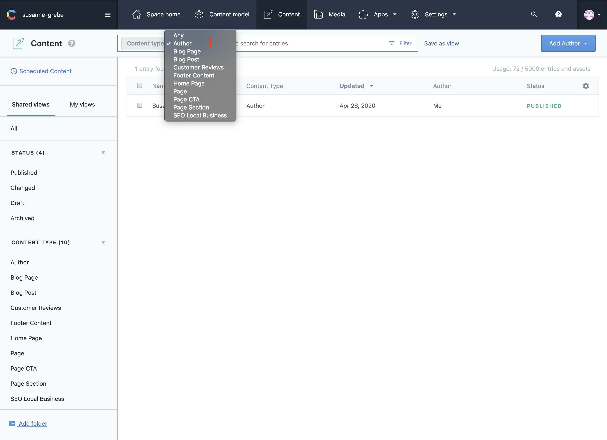
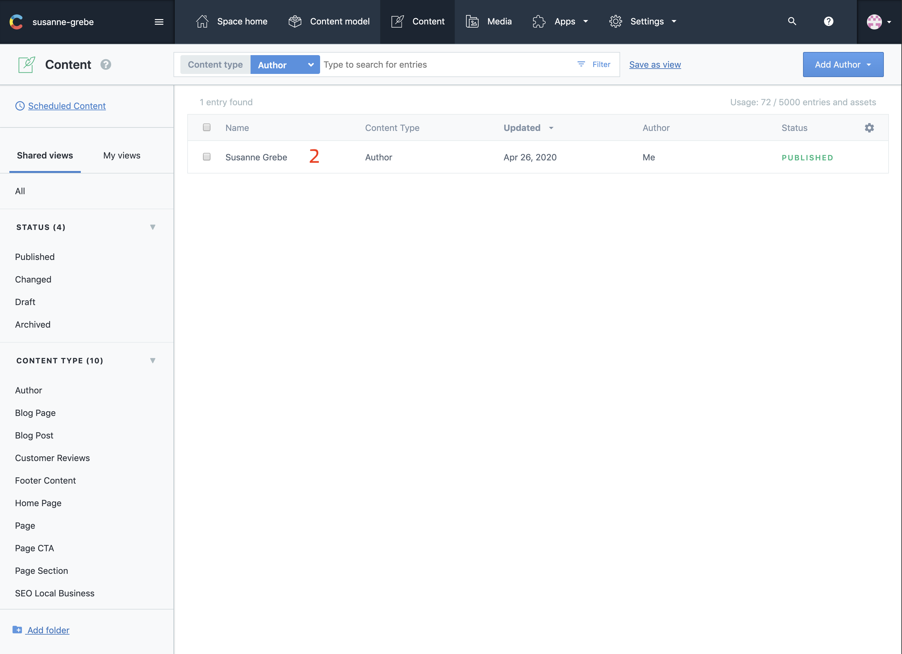
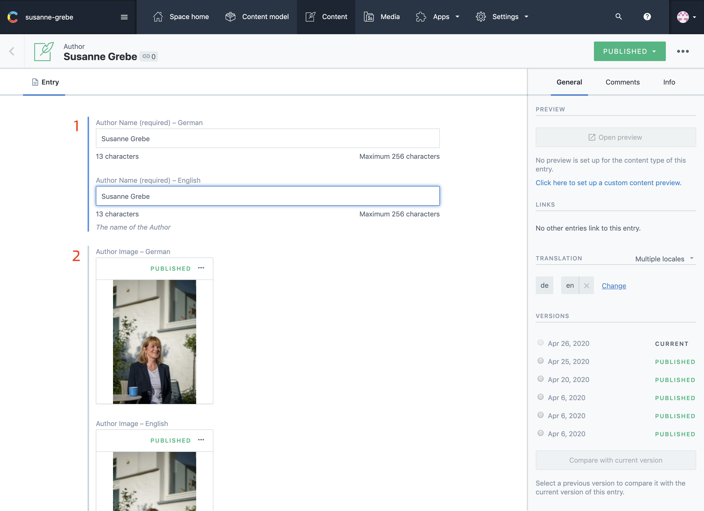
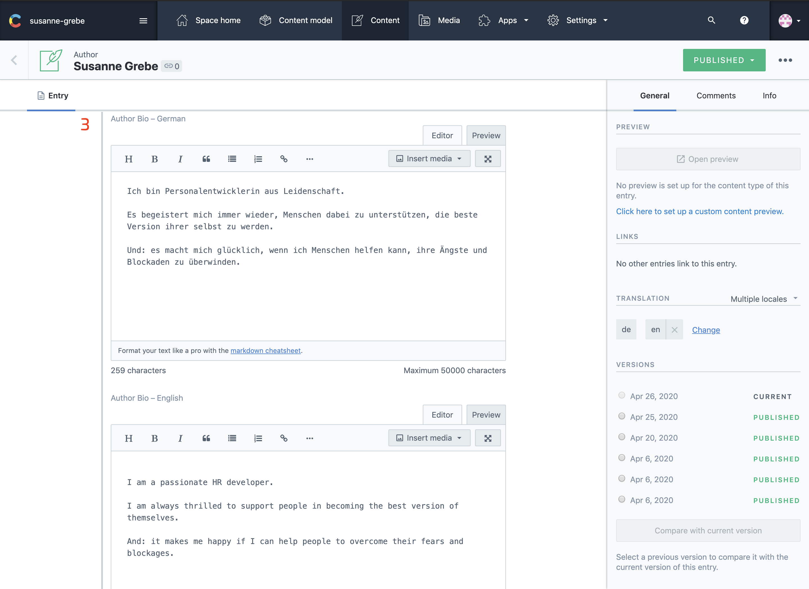
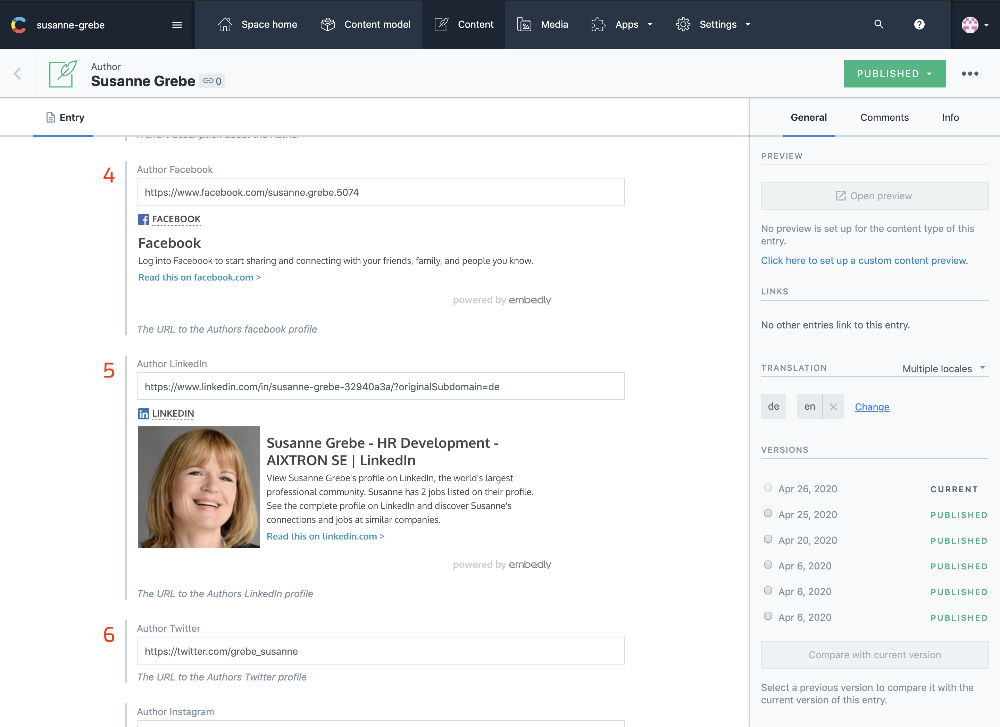
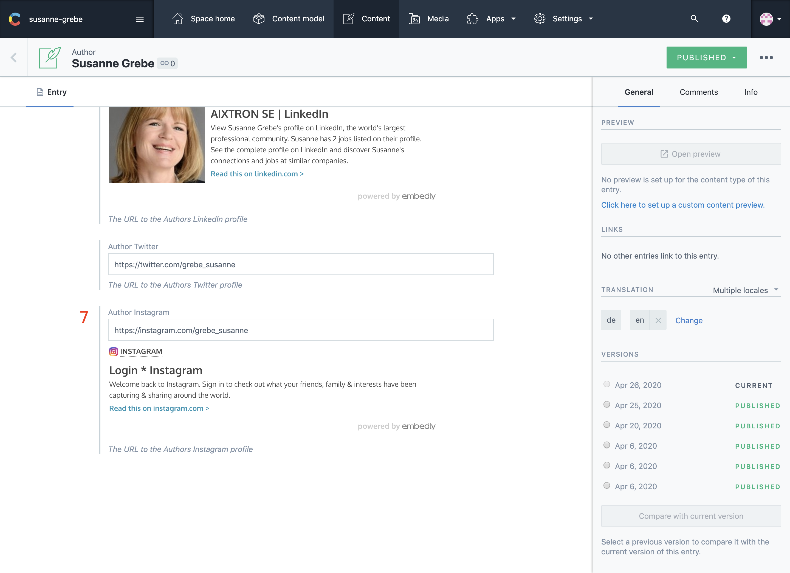
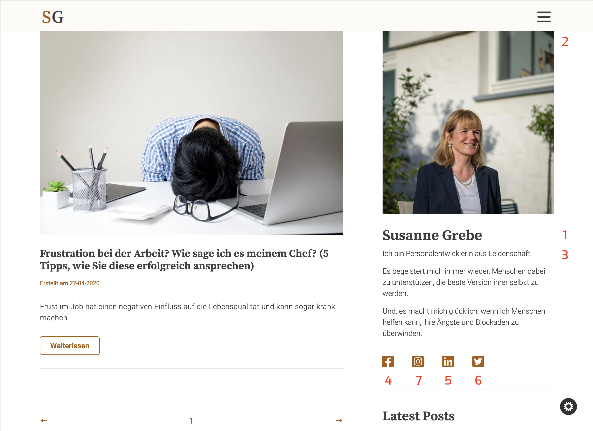
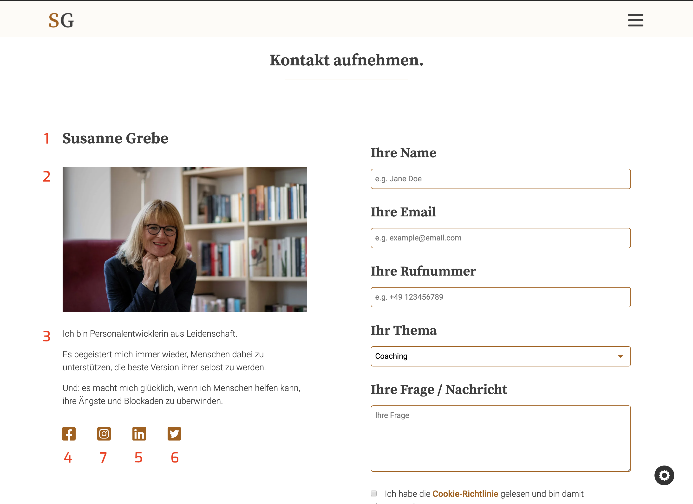

## Introduction

The author content is used on different pages on the website, it shows in the blog sidebar and on the contact page in full.

Author content has no SEO purpose, it is purely used to add some content to the website and give the visitors an option to find you on social media.

---

## Select

1. Select Author
2. Select From List

---

## In Contentful

1. Author Name
2. Author Image

3. Author Bio

4. Author Facebook URL
5. Author LinkedIn URL

6. Author Twitter URL
7. Author Instagram URL

---

## On The Website

### Blog Page

1. Author Name
2. Author Image
3. Author Bio
4. Author Facebook URL
5. Author LinkedIn URL
6. Author Twitter URL
7. Author Instagram URL

### Contact Page

On the contact page I choose to add the local seo company image. This is done for styling purposes. See [SEO Company Image](/articles/Local-Seo/seo-content/#10-seo-comapny-image) on how to update this image.

1. Author Name
2. Local SEO Company Image
3. Author Bio
4. Author Facebook URL
5. Author LinkedIn URL
6. Author Twitter URL
7. Author Instagram URL

