## Introduction

When creating a single blog post it is important to do good keyword research for the title, slug, content and keywords.

Your title should somewhere between 50 and 60 characters long, everything longer will be cut off by the search engine.
In 2019 google announced that they are shifting focus towards mobile search, this means that websites optimized for mobile get priority in the results.

Each blog post should have a unique title and slug, the sulg is created from the title and therefore it's suggested to keep the title short.
You can always edit your slug before you publish it, it's recommended that you add your main keyword in the slug.

The slug is the last part of the URL in the case of `https://www.susanne-grebe.de/blog/frust-im-job` the slug is `frust-im-job`.
Keep all letters lowercase and between each word a `-` 

Some examples:

### Good
```
Title: Frust im job? Wie Sage Ich Es Meinem Chef? (5 Tipps)

slug: https://www.susanne-grebe.de/blog/frust-im-job
```

In the case above your keyword phrase would be `frust im job` which has a search volume of around 90 searches per month and about 892 pages with that keyword used.

In the Articles under Optimizing there is a article that explains how to do your research and find keywords with low competition and high searches.

### Bad 1
```
title: Frust im job?

slug: https://www.susanne-grebe.de/blog/frust
```

### Bad 2
```
title: Wie Sie Frust im Job vermeiden und wieder zu mehr Freude im Beruf finden. Inkl. Coaching-Tipps für Motivation, Jobsuche und Bewerbung
slug: https://www.susanne-grebe.de/blog/wie-sie-frust-im-job-vermeiden-und-wieder-zu-mehr-freude-im-beruf-finden-inkl-coaching-tipps-fur-motivation
```

In aboves examples the bad 1 is way to short, if people see this in the search results they will skip it because they think the content is also short / not relavant.

In bad 2 the title & slug are way to long, half of this title won't even show.

---

## Create A New Blog Post

Adding a new blog post involves 2 steps.

1. Select Blog Post
2. Add Blog Post

You then navigate to a blank blog post. As long as you don't publish the blog post won't show up on the website.

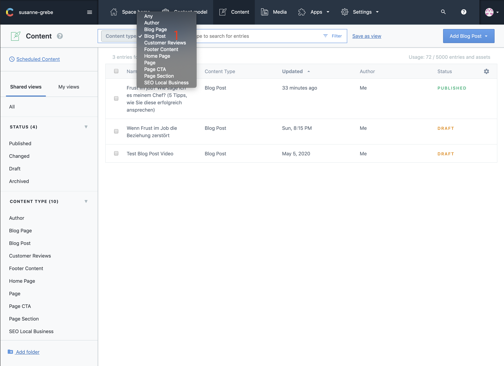

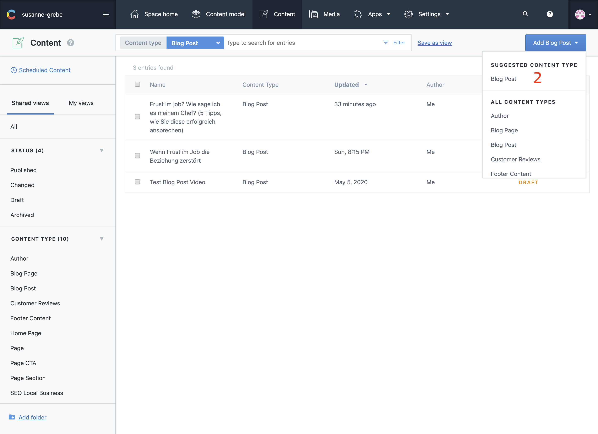

---

## Schedule A Post

Once you created your blog post you have 2 options, one is directly publish the post, two is to set a schedule.

1. Select Set Schedule
2. Action Publish
3. Select A Date
4. Select A Time
5. Schedule

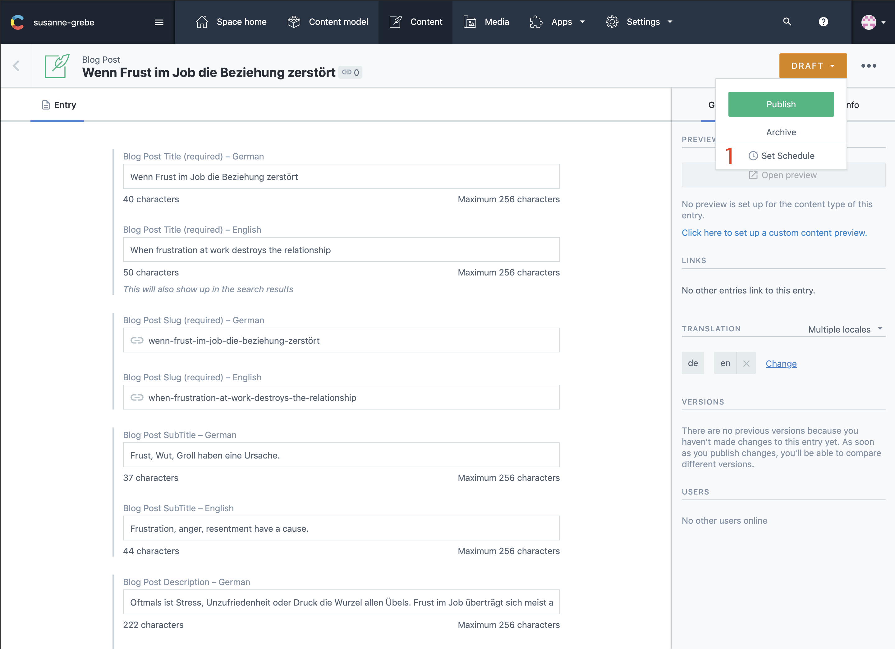

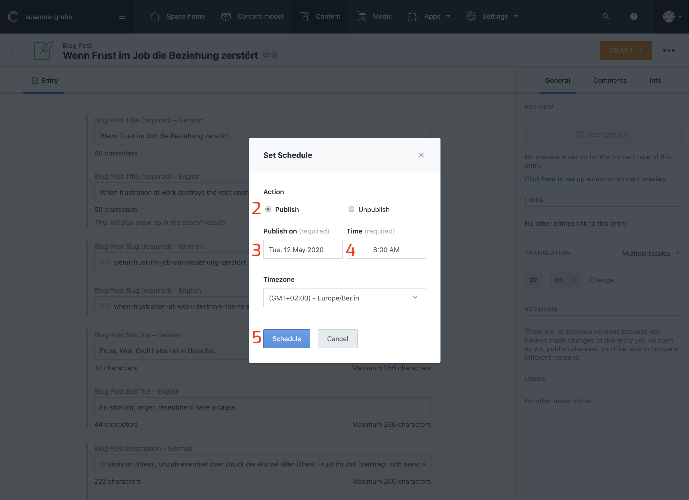

---

## In Contentful

The numbers `1, 4, 6 & 7` are also used for the seo part of this blog post, the numbers `4 & 7` won't be visable on the website itself and can be optimized for the search engines results.

Number `5` the blog excerpt is shown on the home page and is suggested to keep around 190 characters.

For number `8` the blog content you can look at [the content editors documentation](/articles/Contentful/contentful-editor/) to get an idea of all the options you have. 

1. Blog Title
2. Blog Slug
3. Blog Sub Title
4. Blog Description

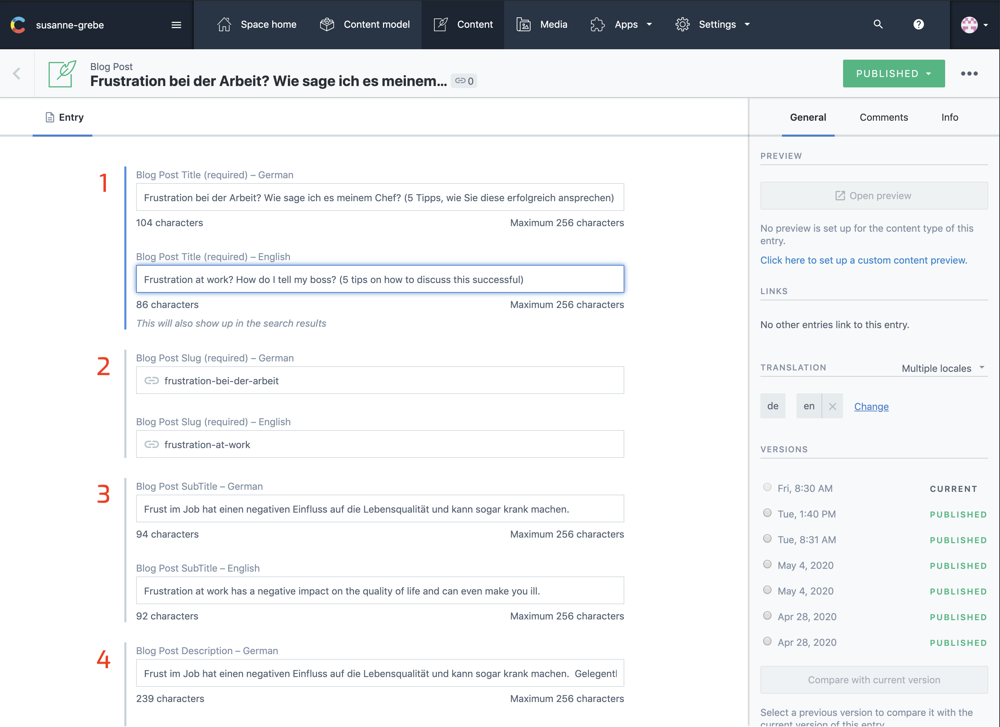

5. Blog Excerpt

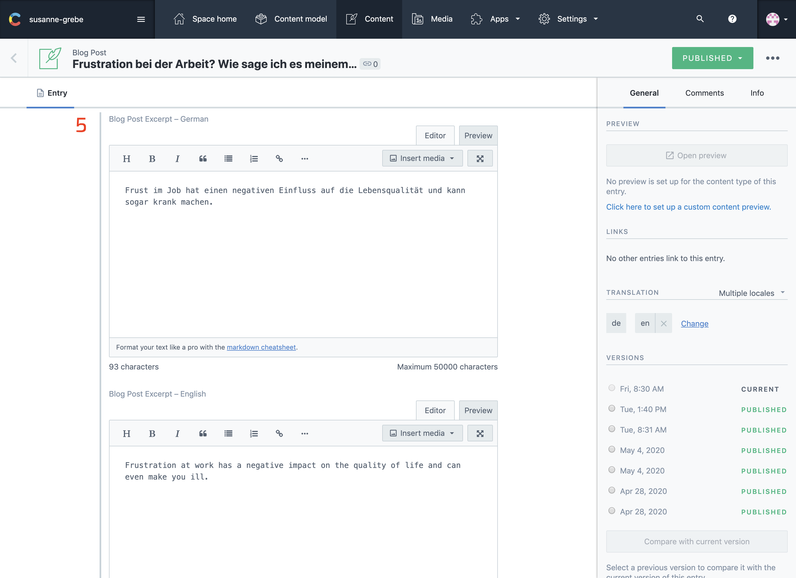

6. Blog Image
7. Blog Keywords

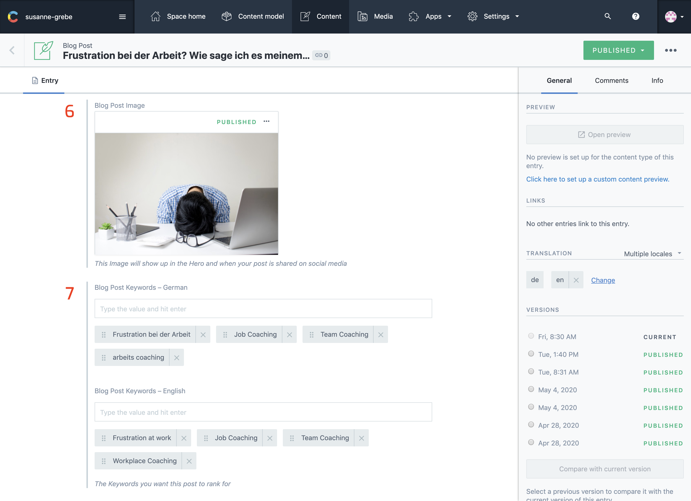

8. Blog Content

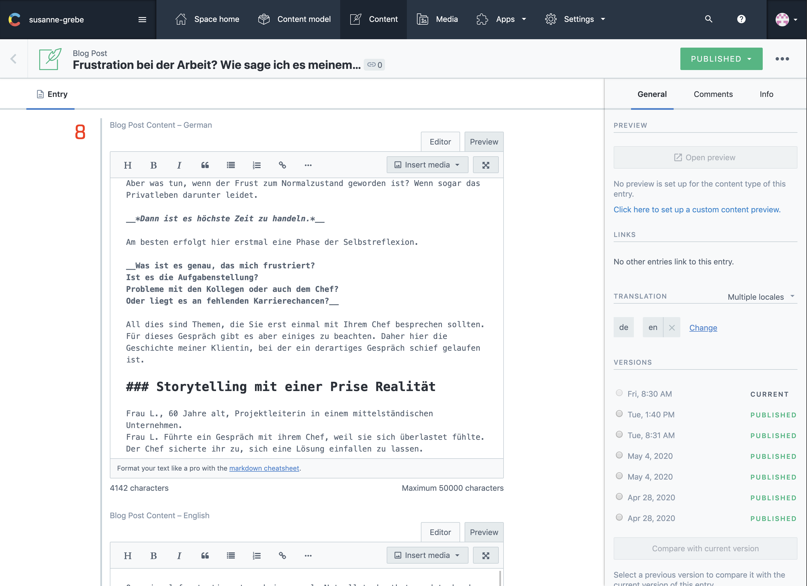

---

## On The Website

6. Blog Image
1. Blog Title
5. Blog Excerpt

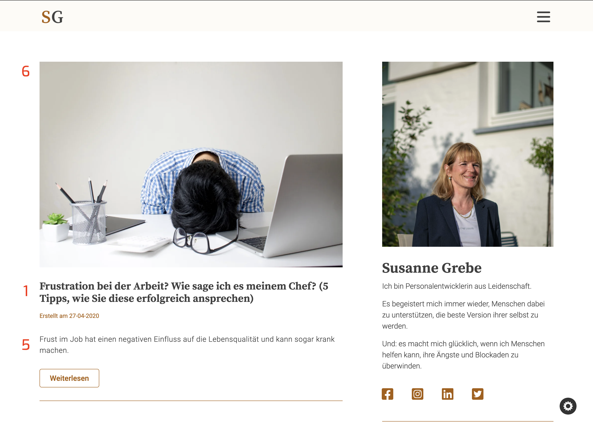

6. Blog Image
1. Blog Title
3. Blog Sub Title

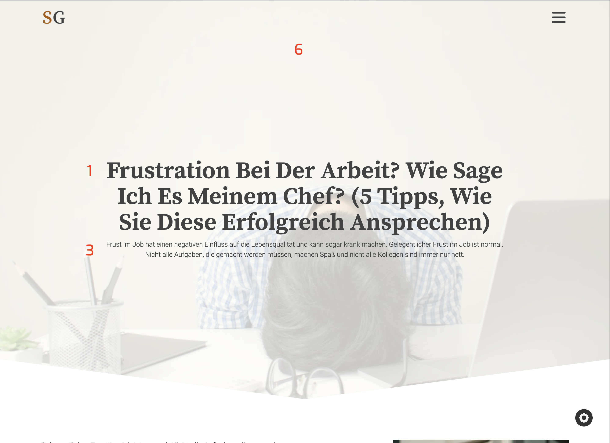

8. Blog Content

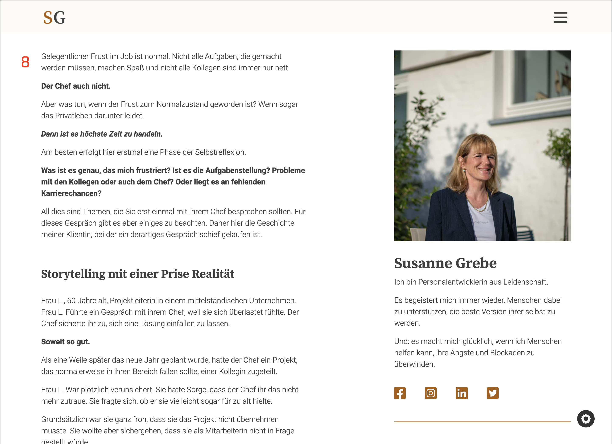