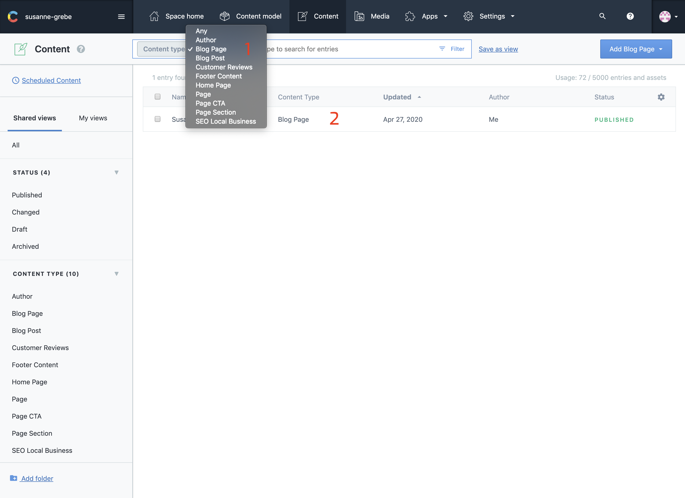
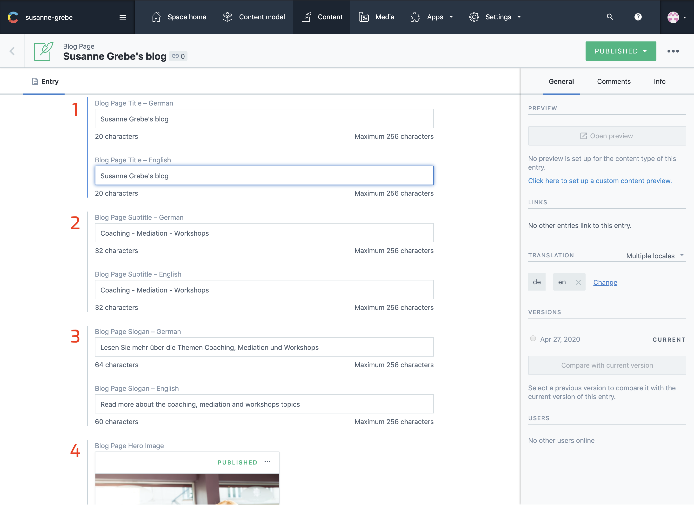
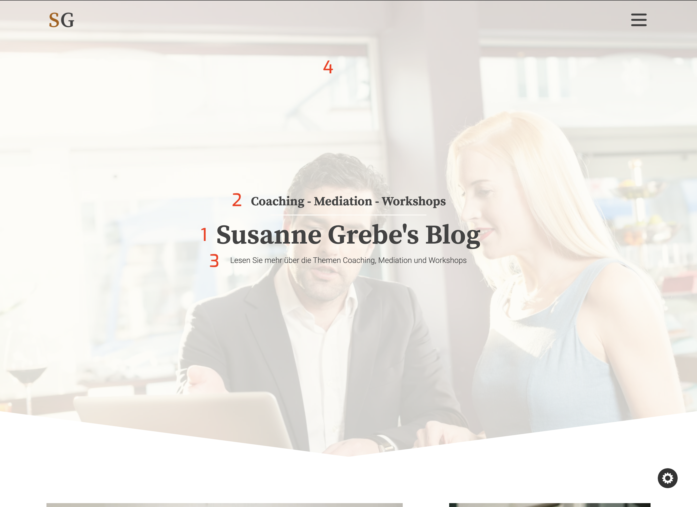

## Introduction

The blog page is an overview page for all the blog posts. Each blog page holds 5 blog posts, and a sidebar with information about the author and the last 3 blog posts.

The author information comes from the author fields in contentful, the name, title, bio and social media are used in the sidebar.
Keep the author bio short, the same content is also used in the footer of the pages.

---

## In Contentful

### Select The Blog Page

To update the content for the blog page follow the two steps below.

1. Select Blog Page
2. Click On The List

### Update Content

The blog page only has content inside the hero. On this page you can update this content.

1. Hero Title
2. Hero Sub Title
3. Hero Slogan
4. Hero Background Image

---

## On The Website

1. Hero Title
2. Hero Sub Title
3. Hero Slogan
4. Hero Background Image

