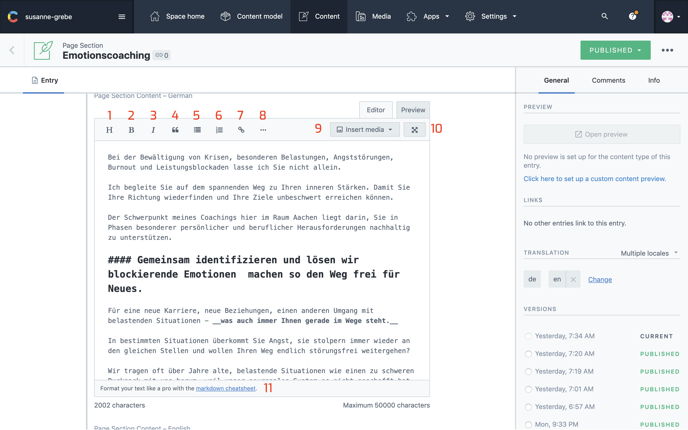
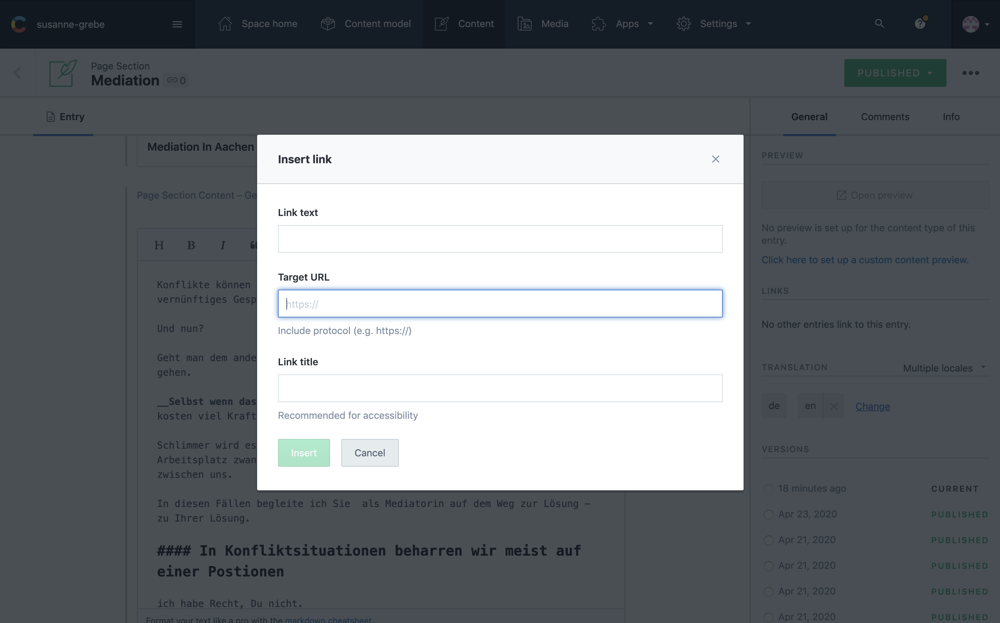
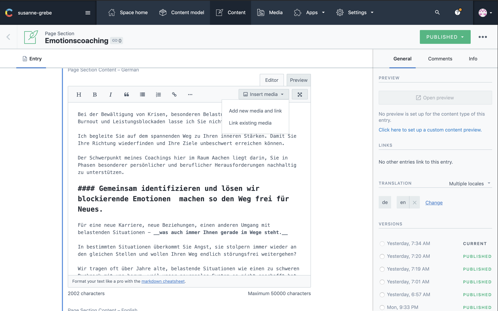
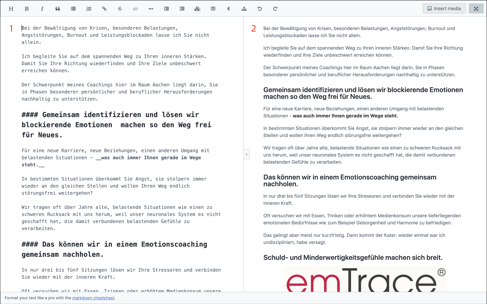
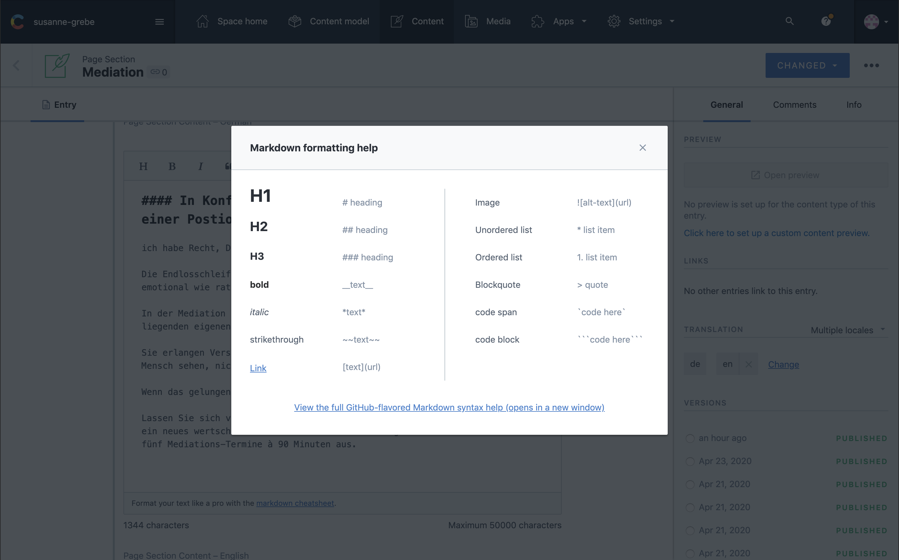

## Image

Each button has a number that corresponds to the number in the title below.
You can click the image to enlarge.



## 1: Headings

By clicking on this button you will be able to insert headings into the file.
It's recommended to use headings level 2 and up towards level 6.

The dropdown only shows Headings level 1 to 3, level 1 is __not__ to be used as each page should only have one level 1 heading.

to visualise this structure:

- heading level 1 __*top of the page*__
	- heading level 2 __*page sections*__
		- heading level 3 __*content headings inside page section*__
	- heading level 2 __*page sections*__
		- heading level 3 __*content headings inside page section*__
			- heading level 4 __*sub heading in content of heading level 3*__
		- heading level 3 __*content headings inside page section*__
		- heading level 3 __*content headings inside page section*__
	- heading level 2 __*page sections*__
		- heading level 3 __*content headings inside page section*__ 

When selecting text and clicking on one of the headings, ```##``` is added in front of that text, there needs to be a space between the ```##``` and the heading. See Examples:

### Good
```
## Heading
```

### Bad
```
##heading
```

### Heading Levels

There are 6 levels which you can also write out like
```
# heading level 1
## heading level 2
### heading level 3
#### heading level 4
##### heading level 5
###### heading level 6
```

### Visual

this is how they would look roughly on the website. A different font-family is used in this theme.

# heading level 1
## heading level 2
### heading level 3
#### heading level 4
##### heading level 5
###### heading level 6

---

## 2: Bold / Strong

To make text stand out you can use the B button, select the text you want to stand out and click the button.

In the html code there will be a strong tag added around that content, this tag tells search engines that it is important content. 

__Note:__ when you click this button it should add ```__``` before and after the text, sometimes when you selected whitespace after the text it looks like this `text here __` this space between `text here` and `__` needs to be removed.

---

## 3: Italic / Emphasize

Italics are typically used to show emphasis (For example: “I don’t care what *he* thinks. I do what I want!”) or to indicate titles of stand-alone works *(Black Panther, Lost in Translation)*.

Same as with __bold / strong__ text you select the text and click the button it inserts a `*` before and after the text. 

Here also counts that there must be no whitespace between the last letter and the `*`

---

## 4: Blockquote

The blockquote Element (or HTML Block Quotation Element) indicates that the enclosed text is an extended quotation. 

Usually, this is rendered visually by indentation.

When selection text and clicking the blockquote button a ```>``` is added in front of the text.

__Note:__ Text for a blockquote should be on a separate line. See examples below

### Good
```
text here

> your block quote

text here
```

### Bad

``` 
text here > your block quote

text here

```

in the last case the whole line will be a blockquote.

---

## 5: Unordered List

An unordered list is a collection of related items that have no special order or sequence. This list is created by using HTML <ul> tag. Each item in the list is marked with a bullet.

To show a list of items you can select this button on a clean line and start typing, everytime you hit enter a new items will be added.

If you want to add sub items under one bullet point you can hit the ```tab``` key, it will then indent the cursor.
To reverse the indent you can hit `shift tab`.

### Text example

```
- list item one
- list item two
	- sub item list item two
- list item three
```

### Visual

- list item one
- list item two
	- sub item list item two
- list item three

---

## 6: Ordered List

An ordered list created using the element, and each list item starts with the element. Ordered lists are used when the order of the list's items is important. The list items in an ordered list are marked with numbers.

To show a list of items you can select this button on a clean line and start typing, everytime you hit enter a new items will be added.

If you want to add sub items under one bullet point you can hit the ```tab``` key, it will then indent the cursor.
To reverse the indent you can hit `shift tab`.

### Text example

```
1. list item one
2. list item two
	1. sub item list item two
3. list item three
```

### Visual

1. list item one
2. list item two
	1. sub item list item two
3. list item three

---

## 7: Insert Link

Inserting links can be done in 2 ways.

One is clicking the button, this will open a pop-up where you have 3 fields.

### Option 1

Using the button.



#### __Field 1 Link Text__

This is the text shown on the website.

#### __Field 2 Target URL__

This is the url where you want your users to navigate to.

#### __Field 3 Link Title__

This is the title added to the link, not visible on the page. It's used for people with disabilities such as hearing or visual impairment.

Inserting a link with the button will move people away from your website, therefore it's recommended that you only use this for internal linking.

### Option 2

Inserting a code snippet.

When you want to link to a different page / website you can also insert the code snippet below.
This code snippet includes a `target="_blank"` attribute which will open up a new window for the user. 

Everytime someone leaves / closes your website google will see this as a bounce.

High bounce % tells google that the content is not relevant for the users search query and thus it will affect your ranking.

By opening up a new window for the user they stay on your page and your bounce rate will not be affected.

```
<a href="TARGET_URL" target="_blank" rel="nofollow noreferrer noopener" title="LINK_TITLE">LINK_TEXT</a>
```

Same as with the button copy paste this snippet, replace the `TARGET_URL` with the url, `LINK_TITLE` with the title and `LINK_TEXT` with the text.


---

## 8: More Options

This button will show a new row with some extra options like:

- table
- line
- striketrough
- text indentation
- special symbols
- undo
- redo
- add external content `youtube video`

---

## 9: Insert Media

There are 2 options when selecting this button.



### 1: Add new media file

Is to create new media. How this is done is explained in [Contentful Media](/articles/Contentful/contentful-media/#languages)

### 2: Link existing media

Select existing media, here you can choose one of your already uploaded images / videos.

when the media is added it will look like in the example below:

```
![Emotionscoaching nach der Emtrace®-Methode]
(//images.ctfassets.net/kg3fs34xij0d/6w00JWNxDJ2b9mg7WOGiVs/dddaac38ce2e046983149a6301932ab1/logo-emTrace-oC.jpg)
```

---

## 10: Full Screen Editor

Clicking this button will enlarge your editor with two views.



### 1: Content Editor

This is the place where you can edit your content

### 2: preview

Here you see a preview of your content. This is not the way it looks on the website, just easier to read without all markdown tags.

---

## 11: Markdown Cheatsheet

This is just a pop-up with some examples of the markdown.



Using markdown can speed up your writing significant, you can only use your keyboard to write content, no need to take the mouse and click on buttons.
It's learning curve is low.

To learn even more about markdown you can look at <a href="https://guides.github.com/features/mastering-markdown/#examples" target="_blank" rel="noopener nofollow noreferrer">Mastering Markdown</a>

---