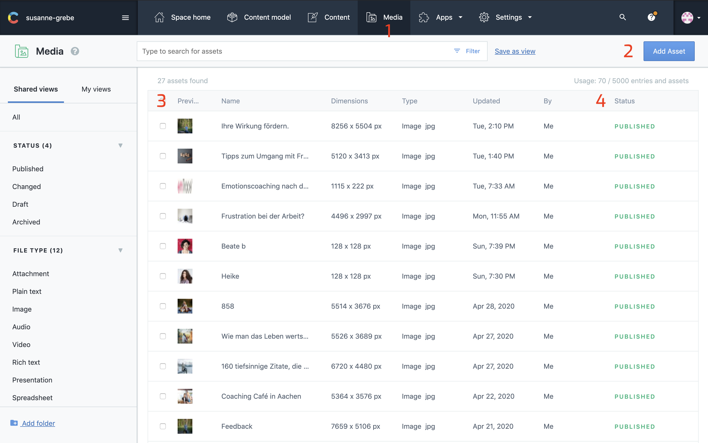
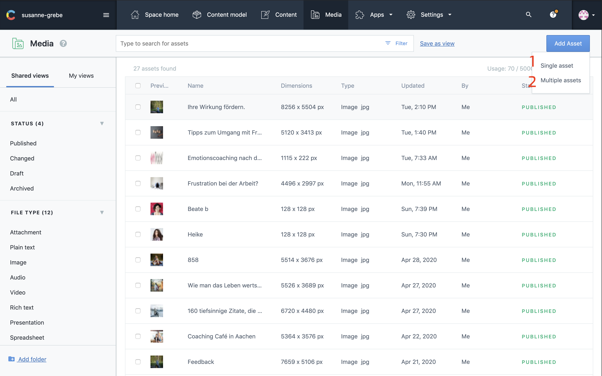
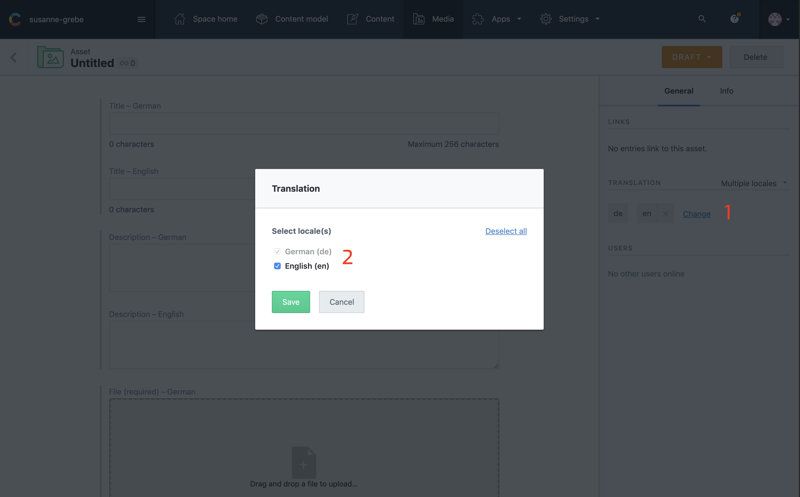
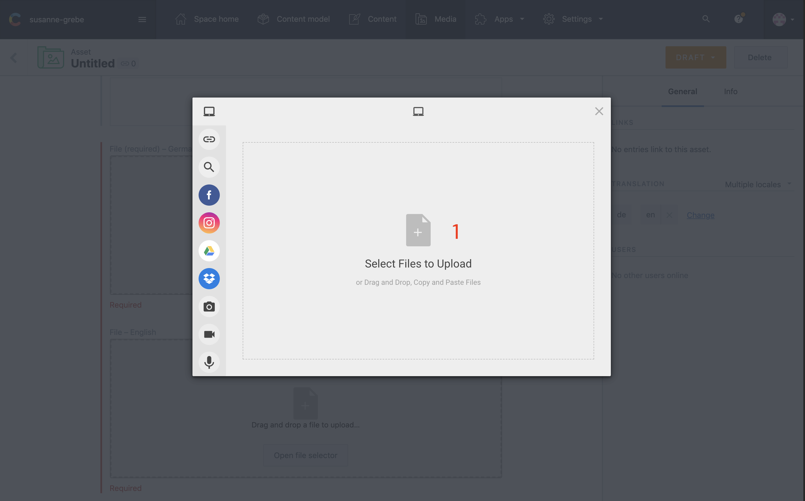
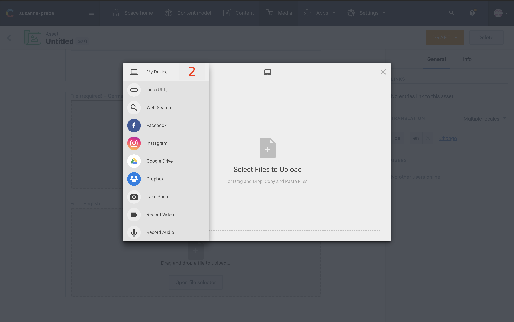
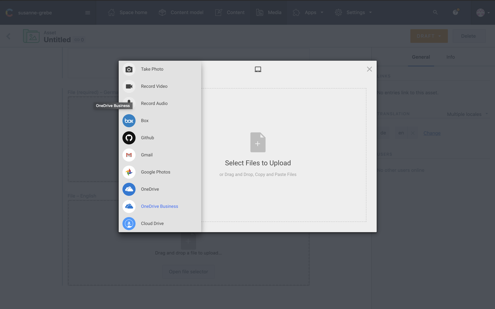
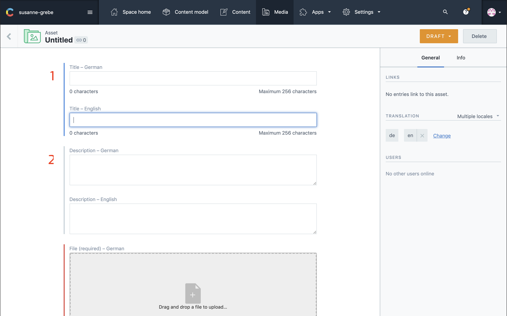

## Image

Each button has a number that corresponds to the number in the title below.
You can click the image to enlarge.



### 1: Select Media

To upload new media make sure you have selected the media tab in the top navigation bar.

### 2: Add New Asset

Clicking this button give you a dropdown with two options to add new media. See [add new asset options](#add-new-asset-options)

### 3: List With Assets

This is an overview of all your assets. You can sort and filter this list in any way.

### 4: Asset Status

This tells you if the asset has been published. If it says draft the asset is not online and not usable on the website.

---

## Add New Asset Options




### 1: Single Asset

Add a single Asset.

### 2: Multiple Assets

Add multiple assets at once.

---

## Languages

Selecting both languages is important, the website relies on both languages.

__Note:__ The next two steps are only neccesary if the languages is only German.



### 1: Open Pop-up

In the side panel select Change, this will open up a pop-up.

### 2: Select Both Languages

Make sure English is selected and save the changes.

---

## Upload File



### 1: File Uploader

By clicking on the file icon you can select assets from your device to upload.

---

## Upload Extra Options




### 2: Options List

When you hover over one of the Icons on the side, a list with other options appears.

You can choose one of the options to upload any new assets.

---

## Renaming Title & Description

The title and description are both 2 important fields as they are being used for people with disabilities and for SEO purposes. 
You increase the possibility to rank for certain keywords in both search and images search.

__Note:__ Make sure both languages are selected. See [languages](#languages) for more details



### 1: Title

The title of the images is a short description of what you see on the image. It's common practise to use your keywords in the title you want to rank for. 
Say for example you want to rank for `coaching in Aachen` the title could be ```Susanne Grebe is coaching five people in Aachen```.

__Note:__ Creating titles this way you increase your chances of people finding your website over image search.

### 2: Description

Here you can add a bit more information plus some extra keywords.

Let's take the example rom above:

```
Susanne Grebe is coaching five people in Aachen to find a better 
balance between work and there private life.
```

This way your image might rank for ```coaching in aachen``` but also for ```find a better balance between work and private```.