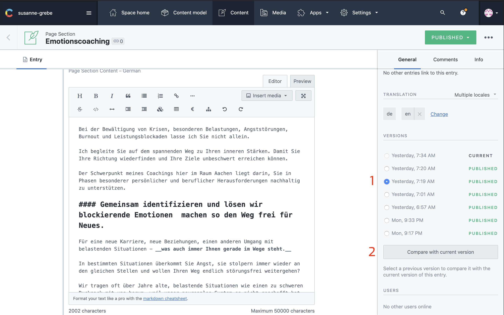
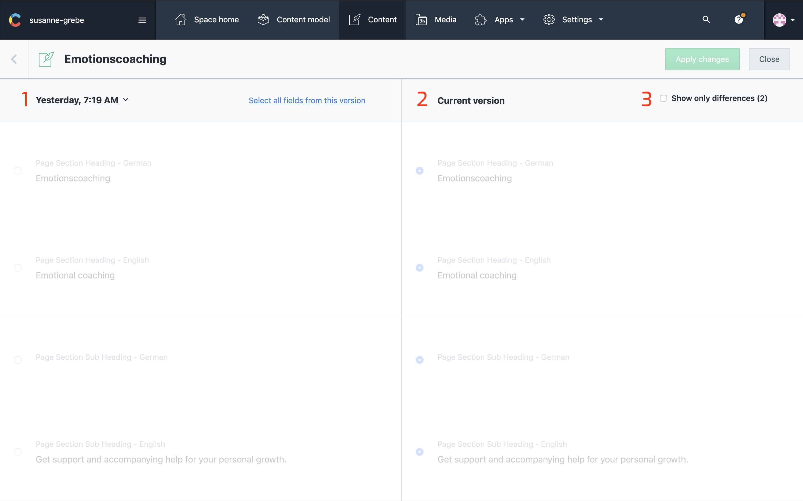
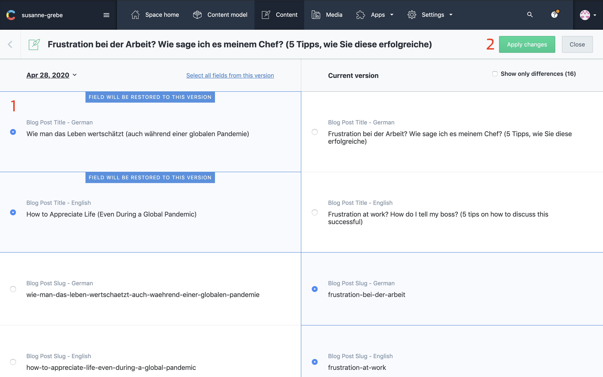

## Reverting Changes

Say you made some changes to your website and one week later you want them changed back but you forgot what the old content was.

Contentful has a really neat feature that tracks your older versions and compares them to newer versions of your content.

---

## Selecting Your Older Version

On the right side you see a panel with the title `VERSIONS`.
It has two columns, left the timestamp and right if it's published and what your current version is.

### 1: Select Your Version

Here you can select the version you want to revert to.

__Note:__ Reverting removes the newer version of your website, make a copy of this content first before making any changes.

### 2: Compare

This will take you to an overview with all the changes from the current version and the selected version of your content.

---

## Overview

### 1: Older Version

In the left column you will see all the fields with the old content.

### 2: Current Version

This is the content as is published now on the website.

### 3: Difference

An ease way to find only the differences in content is by checking this box.

## Make Changes

### 1: Select

Select the content you want to revert, this could be everything or just a title for example.

### 2: Apply

When your certain you want these changes to be made press apply, netlify will rebuild your website with the older content back in place.

