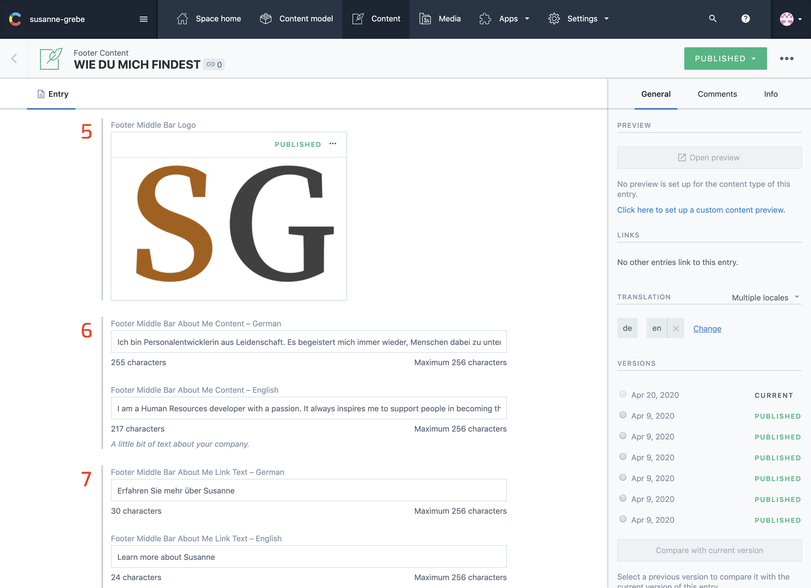

## Introduction

The footer is the very last section on each page, it contains contact information, your logo and links to impressum, datenschutz and the English / German version of the website.

---

## Select

1. Select Footer Content
2. Click Result In List

---

## In Contentful

1. Contact Information Title
2. Street Address
3. Phone Number
4. Button Text

5. Logo
6. Bio / Quote content
7. Link Text To About Page

8. Footer Copyright Text

---

## On The Website

1. Contact Information Title
2. Street Address
3. Phone Number
4. Button Text
5. Logo
6. Bio / Quote content
7. Link Text To About Page
8. Footer Copyright Text

