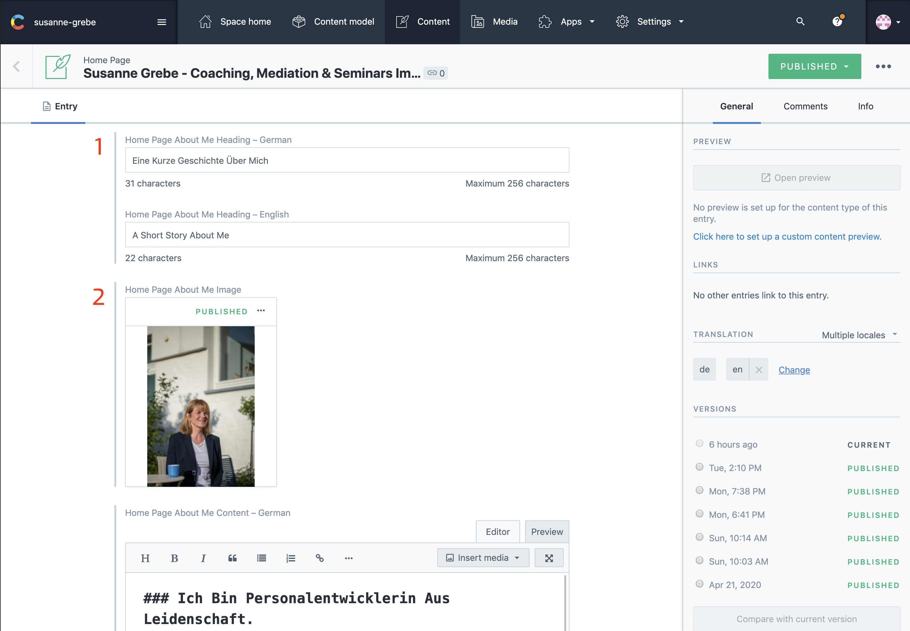
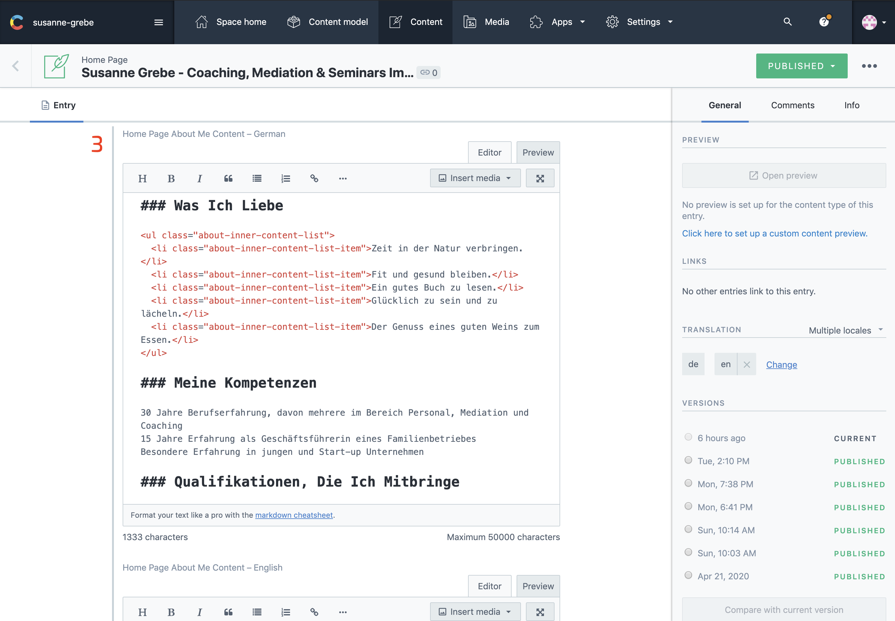
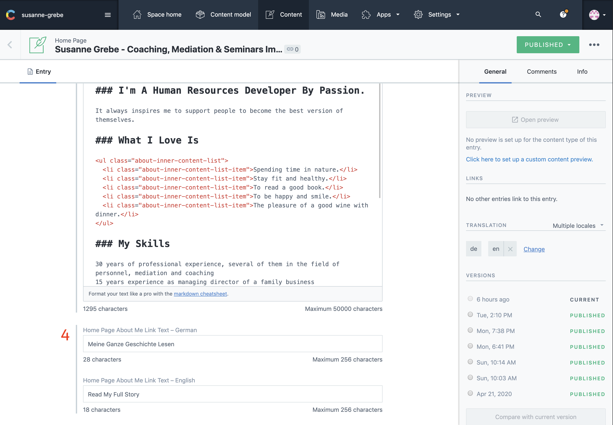
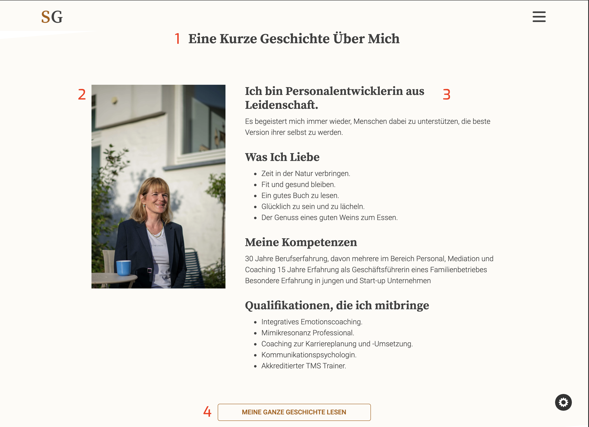

## Introduction

The about section shows a little bit of information about you and what you do, it than has a link towards a dedicated page for more about you.
Here are 2 columns, one holds an image the other some content.

To learn how to use the editor see [contentful editor details](./articles/Contentful/contentful-editor/)

The numbers on the images from contentful correspond with the numbers on the website image. Make sure both languages are selected in the sidebar on the right under `TRANSLATION`

Once all changes are made click `publish` at the right top corner.

---

## In Contentful

1. About Heading
2. About Image

3. About Content

4. About Footer Link Text

---

## On The Website

1. About Heading
2. About Image
3. About Content
4. About Footer Link Text

