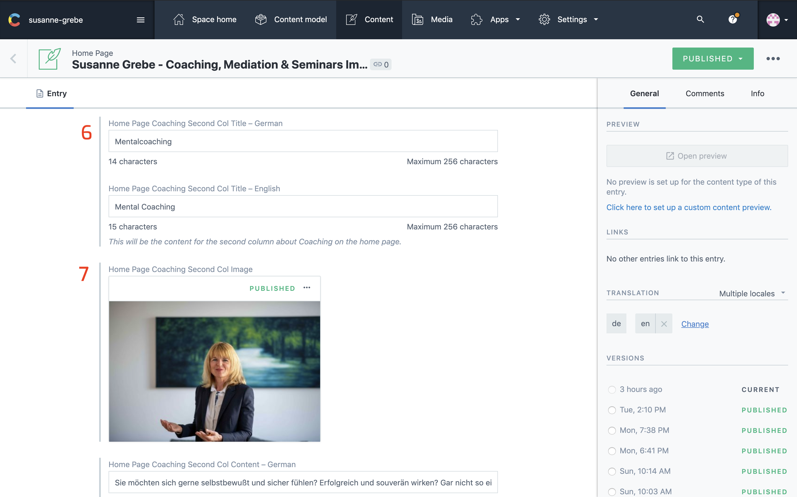

## Introduction

This sections shows your coaching services, in total there are 3 columns. Each column has an Image, title and a short piece of content.

The numbers on the images from contentful correspond with the numbers on the website image.
Make sure both languages are selected in the sidebar on the right under `TRANSLATION`

Once all changes are made click `publish` at the right top corner.

---

## In Contentful

1. Section Header
2. Section Sub Header
3. First Column title

4. First Column Image
5. First Column Content

6. Second Column Title
7. Second Column Image

8. Second Column Content

9. Third Column Title
10. Third Column Image
11. Third Column Content

12. Section Footer Link Text

---

## On The Website

1. Section Header
2. Section Sub Header
3. First Column title
4. First Column Image
5. First Column Content
6. Second Column Title
7. Second Column Image
8. Second Column Content
9. Third Column Title
10. Third Column Image
11. Third Column Content
12. Section Footer Link Text

