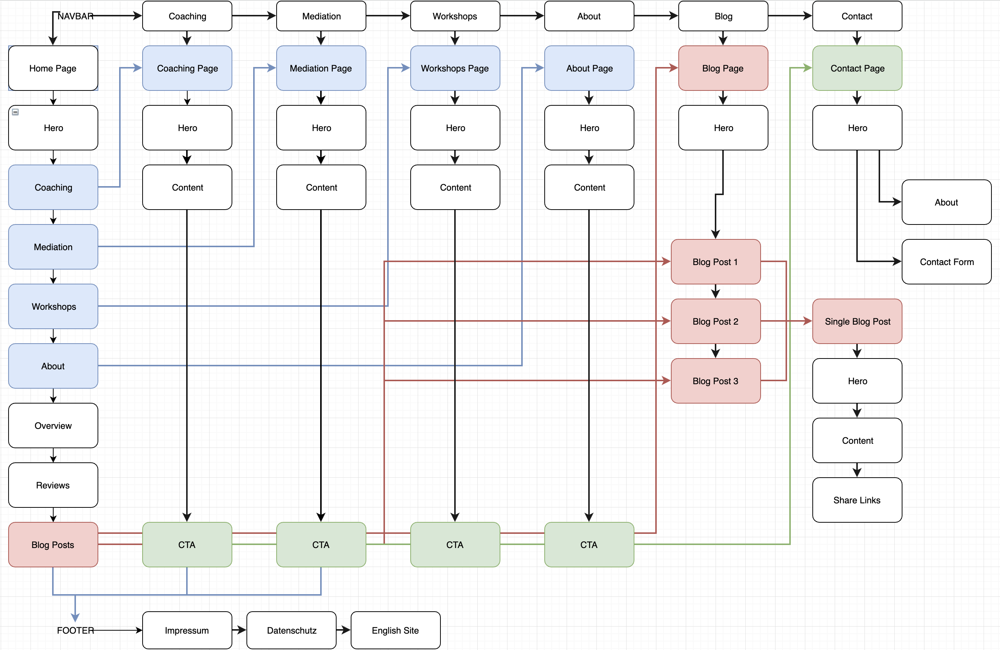

This is the first page users end on when they go to <a href="https://www.susanne-grebe.de" target="_blank" rel="noopener noreferrer nofollow">https://www.susanne-grebe.de</a>.

The homepage is build up in a few different sections. Each senction has a different function.
Each page of the website can be access via this page.

## Website Overview Visual

## The Sections

### 1: Seo Section

The seo section is not visible on the website, this is content that is placed inside the head of the code.

### 2: Hero Section

The Hero section is the top of the page and first visible to the user when they open the website.

### 3: Coaching Section

This section is dedicated to display 3 of your coaching services. It has a link to a separate page that has more information about coaching.

### 4: Mediation Section

This section is dedicated to display your Mediation services. It has a link to a separate page that has more information about mediation.

### 5: Workshops Section

The same as with [coaching section](#coaching-section) this space is dedicated for displaying some workshops. It also has a link to a workshops page.

### 6: About Section

Here you tell a short story about yourself. It links to your full bio page.

### 7: Overview Section

This is the section where you can show some achievements for your customers.

### 8: Review Section

If your customer leaves you a review, you can add it to this section

### 9: Latest Blog Posts Section

Your latets 3 blog-posts will be shown here. 