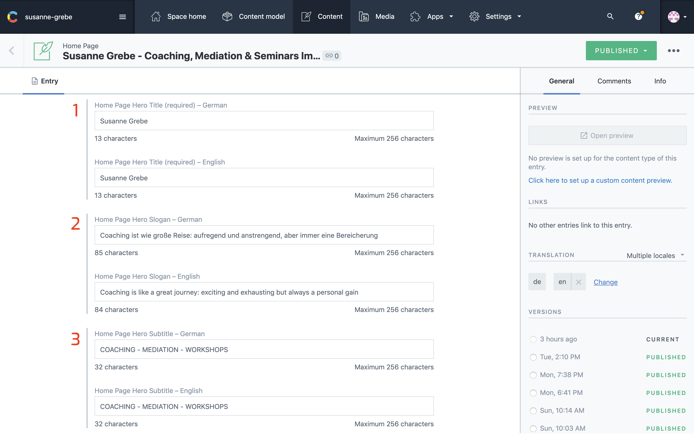
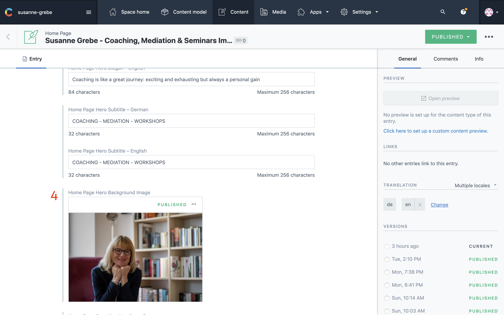

## Introduction

In this section you can update the title, slogan, sub-title and the background image of the hero from the home page.

The numbers on the images from contentful correspond with the numbers on the website image. Make sure both languages are selected in the sidebar on the right under `TRANSLATION`

Once all changes are made click `publish` at the right top corner.

---

## In Contentful

1. Hero Title
2. Hero Slogan
3. Hero Sub-Title

4. Hero Background Image

## On The Website

1. Hero title
2. Hero slogan
3. Hero sub-title
4. Hero background image

