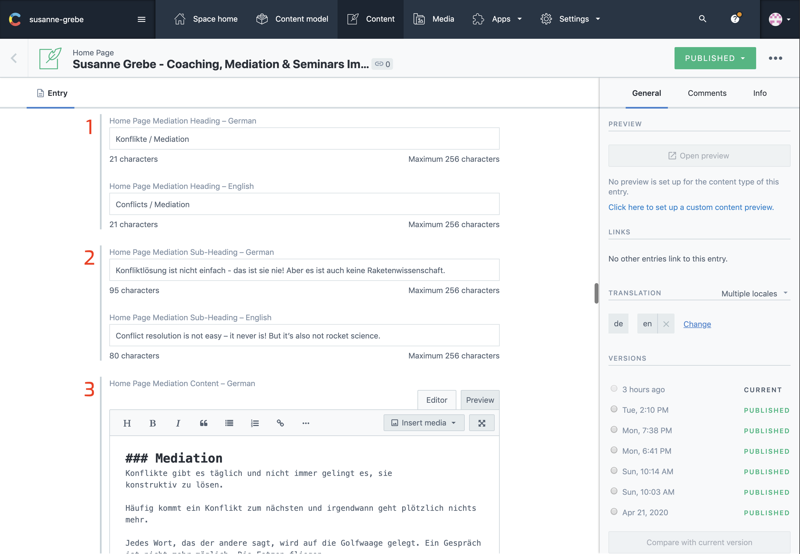
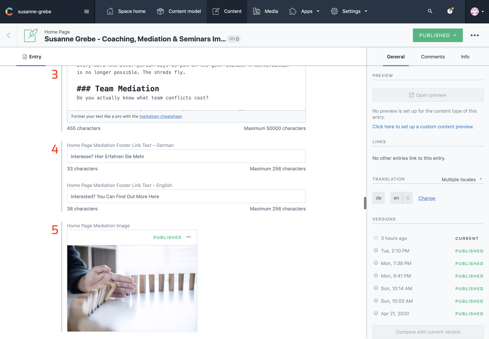
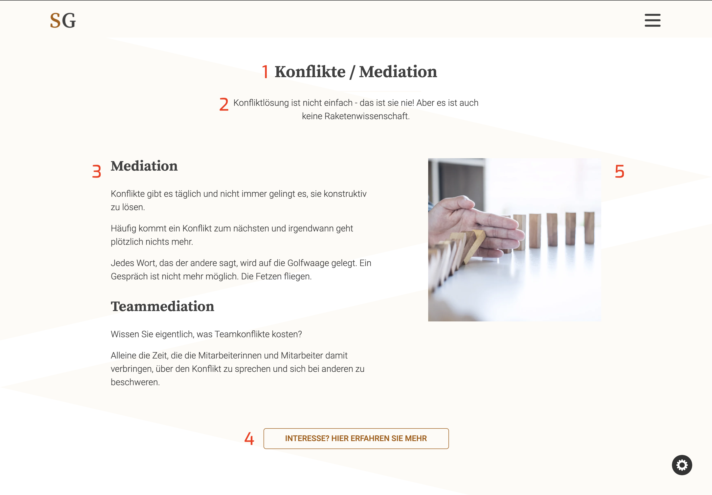

## Introduction

The mediation section shows a little bit of content about mediation, it than has a link towards a dedicated page for mediation.
Here are 2 columns, one holds an image the other some content.

To learn how to use the editor see [contentful editor details](./articles/Contentful/contentful-editor/)

The numbers on the images from contentful correspond with the numbers on the website image. Make sure both languages are selected in the sidebar on the right under `TRANSLATION`

Once all changes are made click `publish` at the right top corner.

---

## In Contentful

1. Mediation Heading
2. Mediation Sub Heading
3. Mediation Content

4. Mediation Footer Link Text
5. Mediation Image

---

## On The Website

1. Mediation Heading
2. Mediation Sub Heading
3. Mediation Content
4. Mediation Footer Link Text
5. Mediation Image

