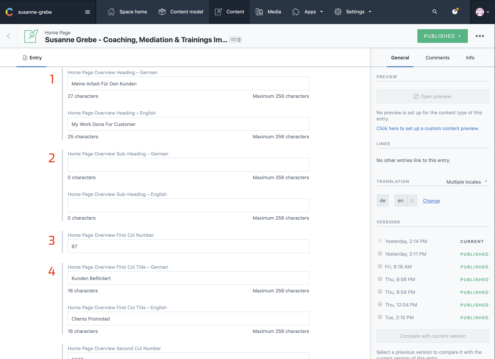
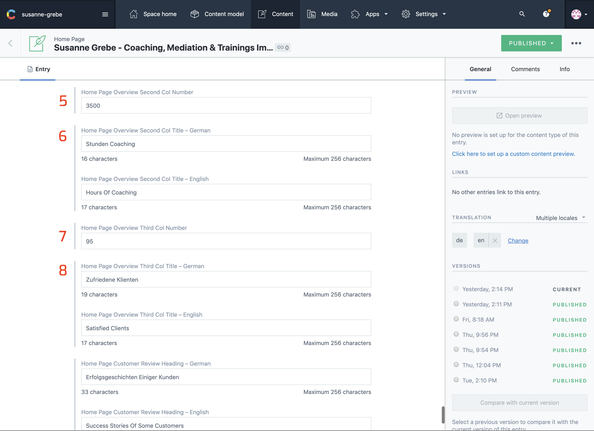
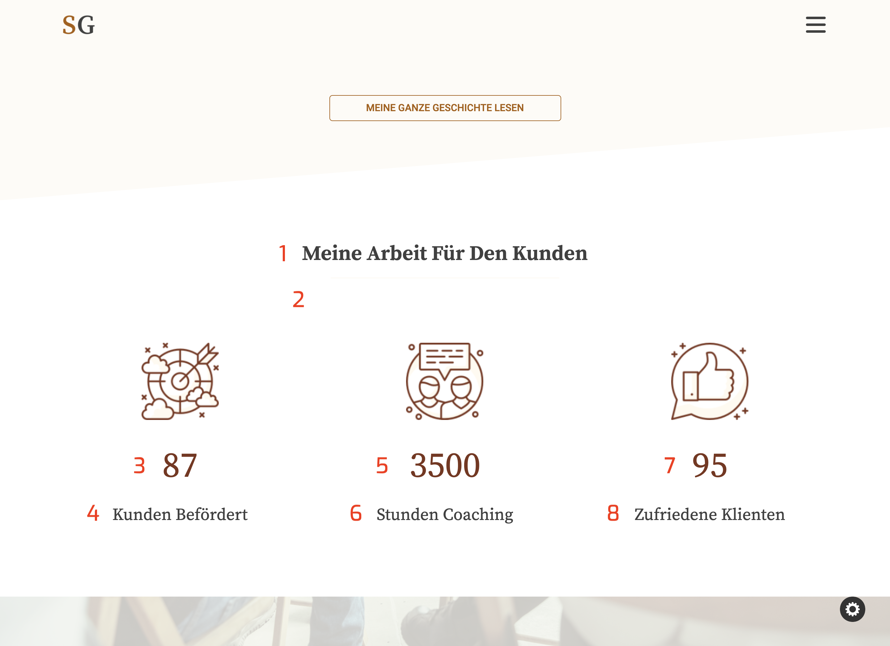

## Introduction

This section show an overview of the amount of clients you helped and how many hours you spend on this.

The section is split up in 3 columns on larger screens, 2 on tablets and 1 on mobile devices

The numbers on the images from contentful correspond with the numbers on the website image. Make sure both languages are selected in the sidebar on the right under `TRANSLATION`

Once all changes are made click `publish` at the right top corner.

---

## In Contentful

1. Overview Heading
2. Overview Sub Heading
3. Overview First Column Number
4. Overview First Column Title

5. Overview Second Column Number
6. Overview Second Column Title
7. Overview Third Column Number
8. Overview Third Column Title

---

## On The Website

1. Overview Heading
2. Overview Sub Heading
3. Overview First Column Number
4. Overview First Column Title
5. Overview Second Column Number
6. Overview Second Column Title
7. Overview Third Column Number
8. Overview Third Column Title

