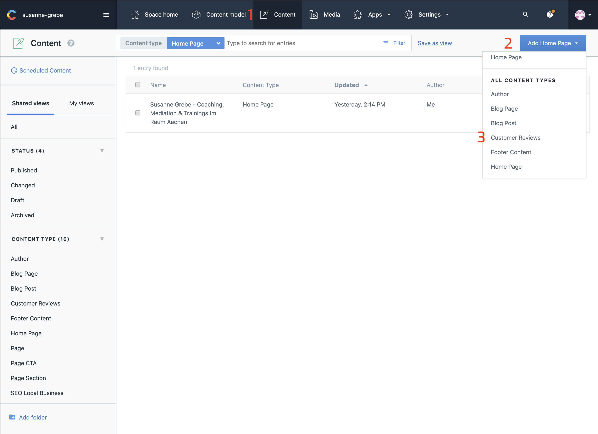
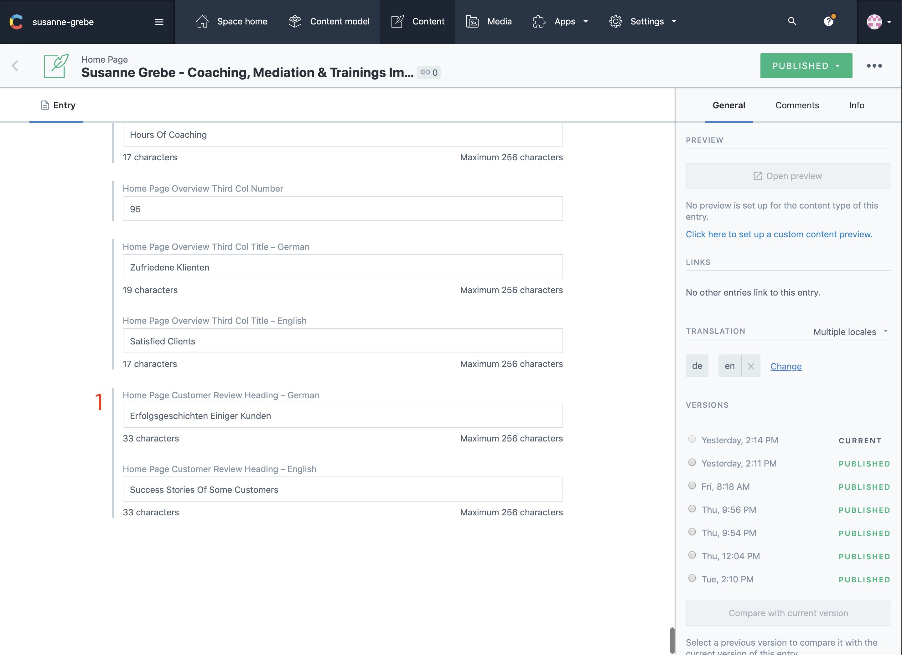
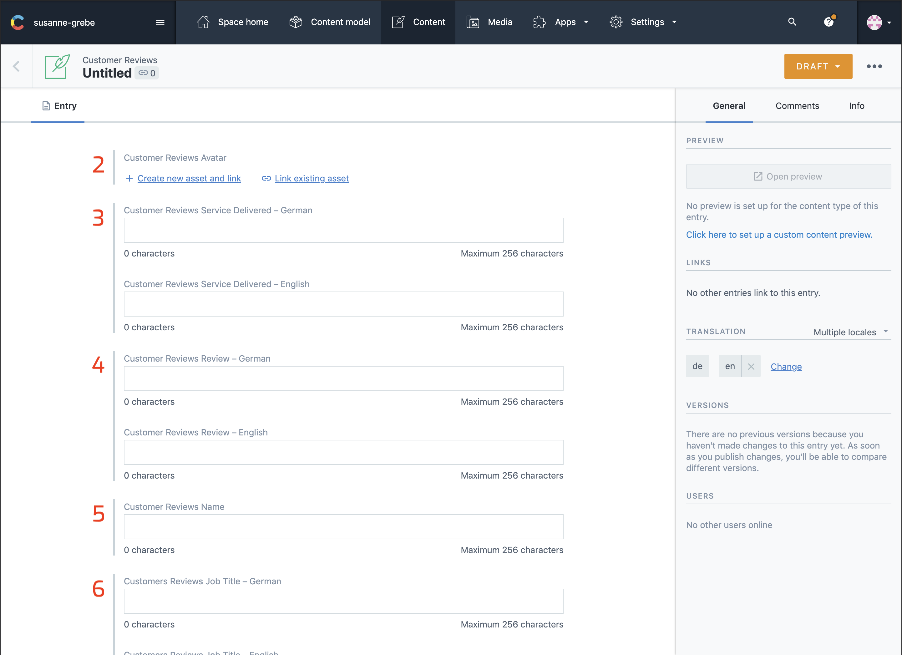

## Introduction

In this section you can display some reviews you got from customers. Customer reviews will add social proof to your website. 

Your potential clients will know that you're a trusted brand. Moreover, customer feedback will give you insights into how you could improve your product and the overall buying experience.

## In Contentful

### Creating A New Review

Creating a new review for the home page is done in 3 steps.
First make sure you are on the content tab which displays all your content, then click the button that says `Add ...` Depending on your last action or filter this might differ.
In the list of the drodown select Customer Review, this will open up the customers review creation page.

There is no limit to the amount of customer reviews you can display, suggested is to keep it between 3 and 9.

__Note:__ The `Reviews Services Delivered` is an `heading level 3`  to increase the amount of keywords on the page. Make sure you add some mixed reviews not all for one service.

1. Select Content
2. Select Add
3. Select Customer Reviews

### The Fields

The reviews heading is updated in the home page content. The rest of the content is created and updated in customer review.
This way you can add unlimited reviews to your home page.

1. Reviews Heading

2. Reviews Avatar
3. Reviews Services Delivered
4. Reviews Customer Review
5. Reviews Customer Name
6. Reviews Customer Job Title

## On The Website

1. Reviews Heading
2. Reviews Avatar
3. Reviews Services Delivered
4. Reviews Customer Review
5. Reviews Customer Name
6. Reviews Customer Job Title

