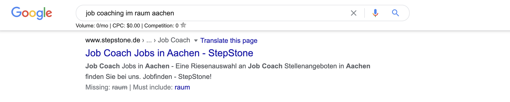
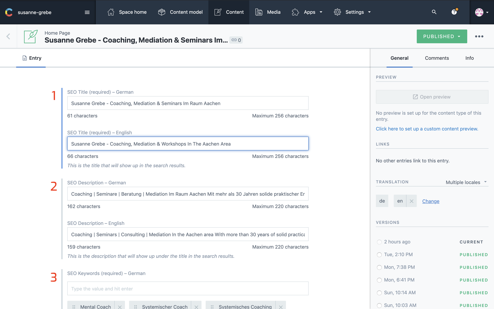
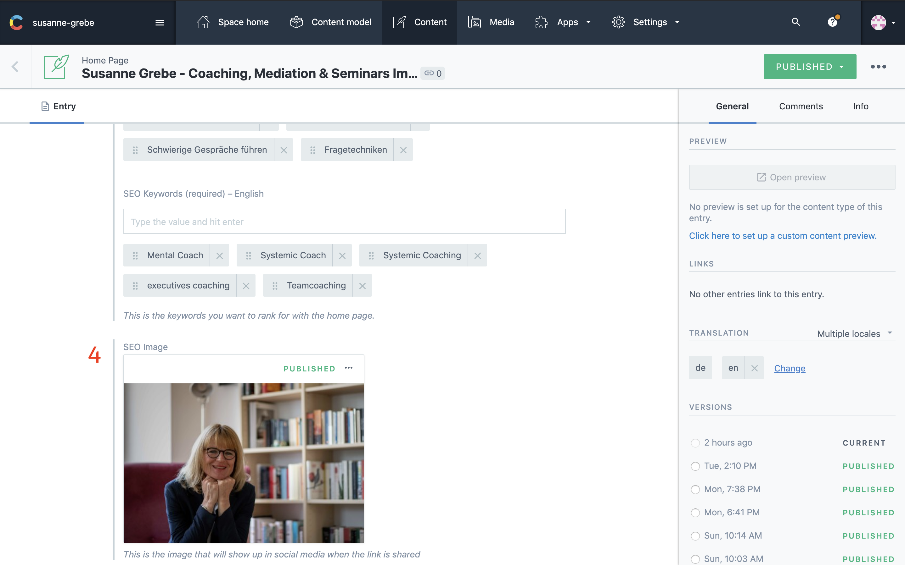

## SEO 

This section is purely to update the seo of your website. It is displayed in the google search results.

---

### 1: SEO Title

The title is the most important seo text you have. This is the title users click on in the search results.

Adding your keywords in here is of great importance, but keep it readable.

#### Good

```
Susanne Grebe - Coaching, Mediation & Seminare Im Raum Aachen
```

#### Bad

```
Susanne Grebe Coaching Mediation Seminare Aachen
```

Capitalize your titles to make them stand out more.

### 2: SEO Description

This is the description you see under the title in the search results.

Here you can also add keywords, make an interesting description about the services you offer. 



as you can see in the image above, a few words are made bold in the description.
Google's algorithm is smart enough to understand user intent. In this case is sees Job coaching and says maybe job coach is something you want to look for to.

__Note:__ Use synonyms for keywords in the description.

### 3: SEO Keywords

This is the place where you can use your keywords, it doesn't have to be readable for humans. Google search bot sees the keyword meta tag when it scans the website, it than stores all the keywords and starts indexing your pages for each keyword.

If you add a keyword `Mediation` it scans all pages and counts how often this keyword is found on each page.

This means on the mediation page the keyword density is higher than on the other pages, telling the search bot that this page is more important to show when someone searches for mediation.

I use the website <a href="https://wordcounter.net" target="_blank" rel="noopener nofollow noreferrer">https://woudcounter.net</a> to count the amount of words.

On the site you see a keyword Density field, in there you can find how many % of your text uses that keyword don't overdo this keep it around 2-3%.



---

### 4: SEO Image

This is the image that shows up when the home page is share on any platform, facebook, linkedIn, Twitter, telegram, whatsapp and more.

