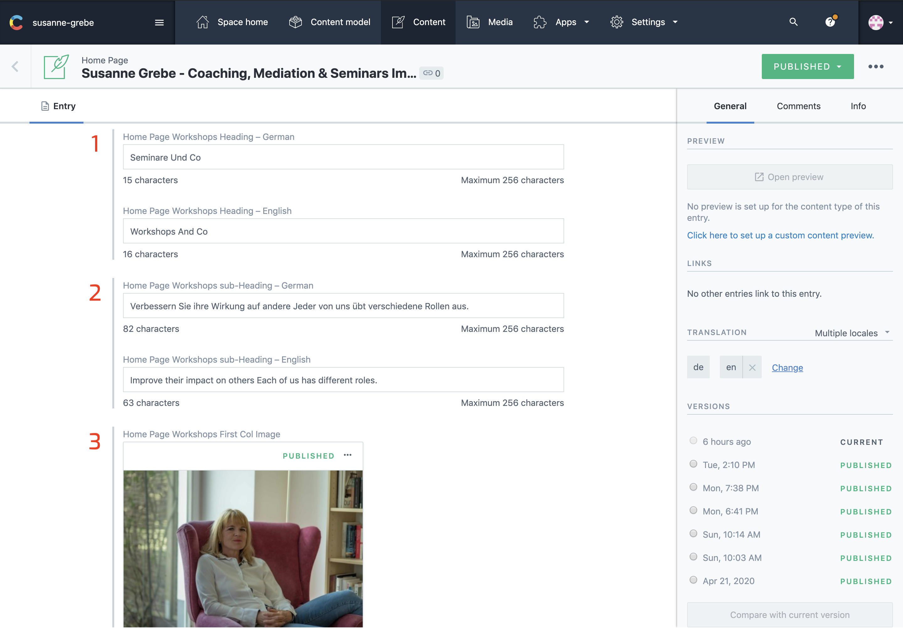
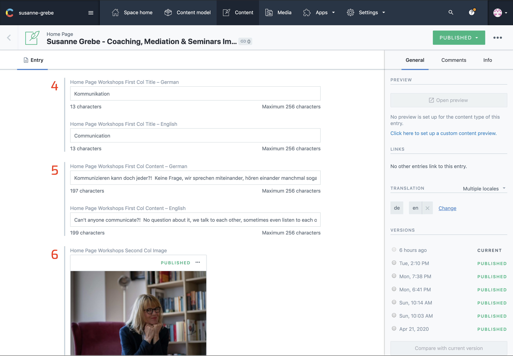
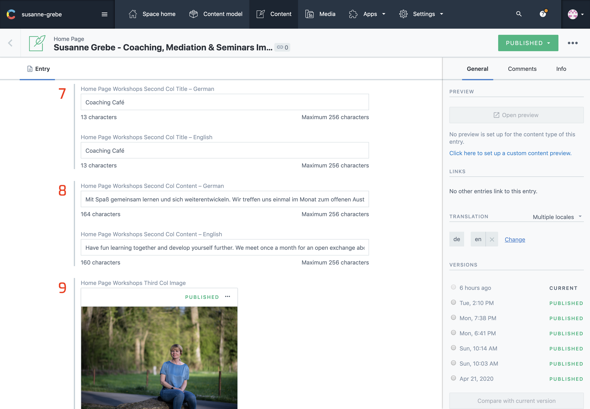
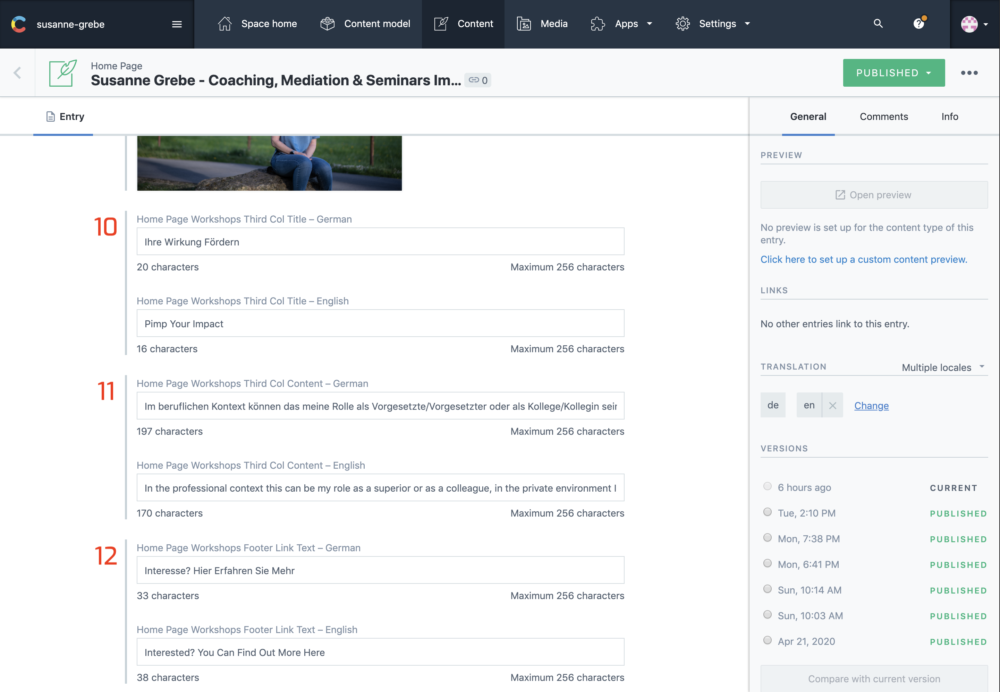
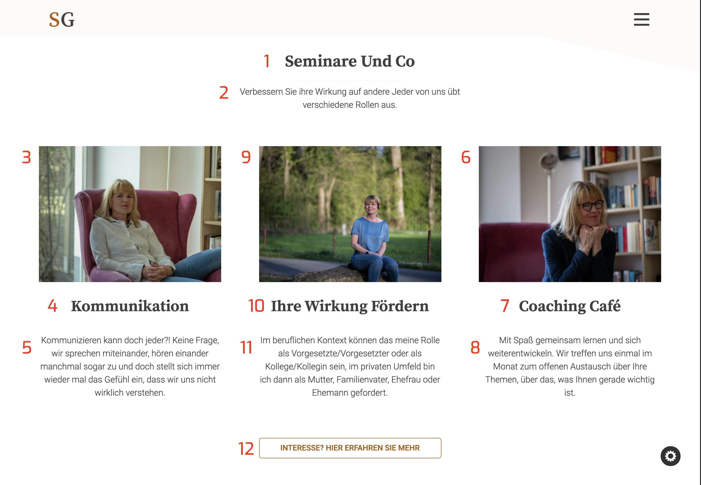

## Introduction

This sections shows your workshops, in total there are 3 columns. Each column has an Image, title and a short piece of content.

The numbers on the images from contentful correspond with the numbers on the website image. Make sure both languages are selected in the sidebar on the right under `TRANSLATION`

Once all changes are made click `publish` at the right top corner.

---

## In Contentful

1. Workshops Heading
2. Workshops Sub Heading
3. Workshops First Col Image

4. Workshops First Col Title
5. Workshops First Col Content
6. Workshops Second Col Image

7. Workshops Second Col Title
8. Workshops Second Col Content
9. Workshops Thrid Col Image

10. Workshops Thrid Col Title
11. Workshops Thrid Col Content
12. Workshops Footer Link Text

---

## On The Website

1. Workshops Heading
2. Workshops Sub Heading
3. Workshops First Col Image
4. Workshops First Col Title
5. Workshops First Col Content
6. Workshops Second Col Image
7. Workshops Second Col Title
8. Workshops Second Col Content
9. Workshops Thrid Col Image
10. Workshops Thrid Col Title
11. Workshops Thrid Col Content
12. Workshops Footer Link Text

