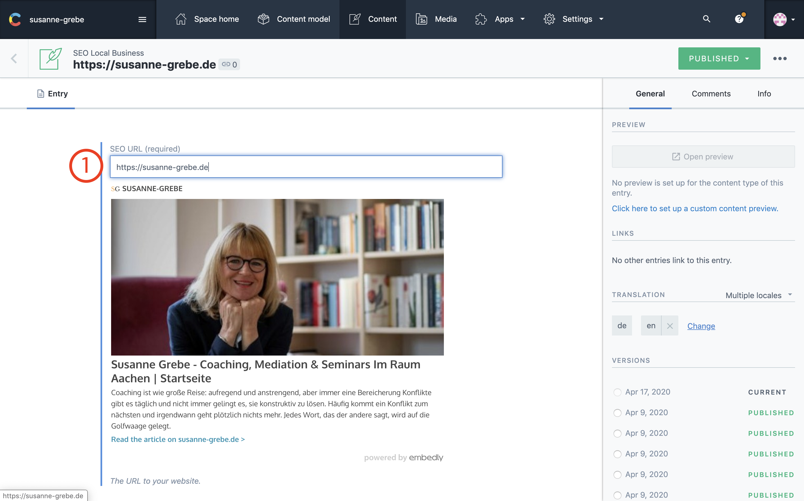
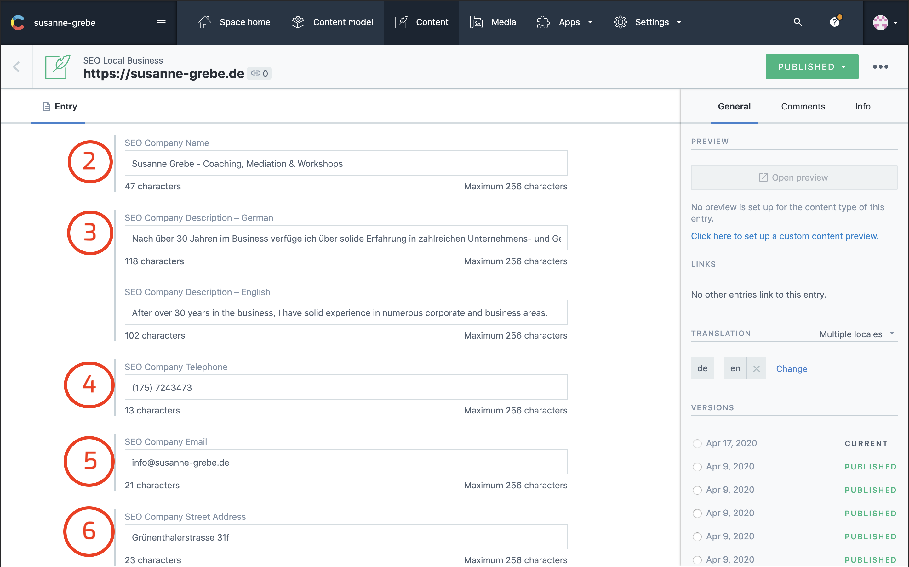
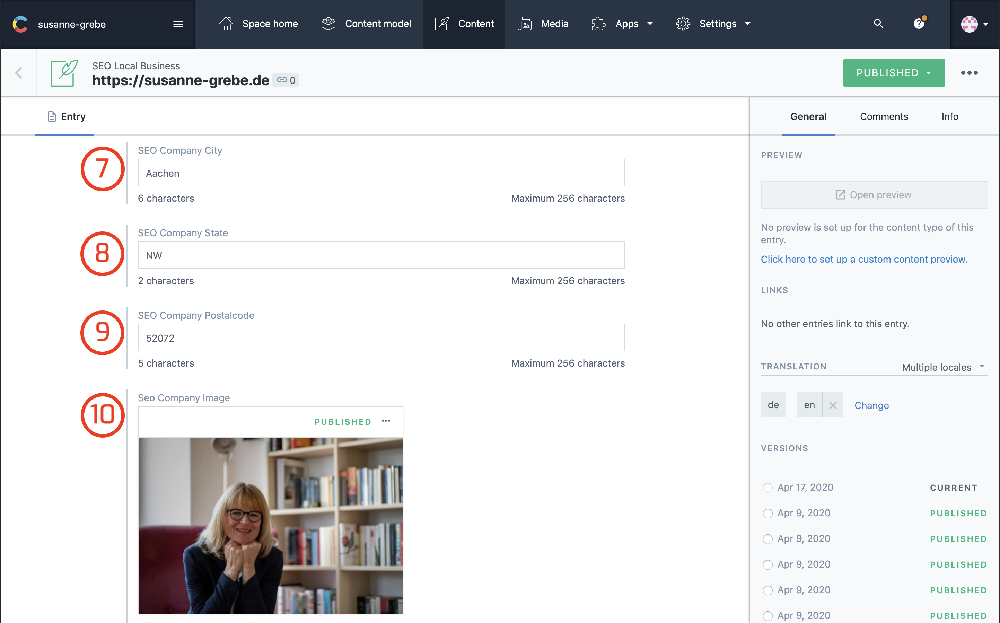
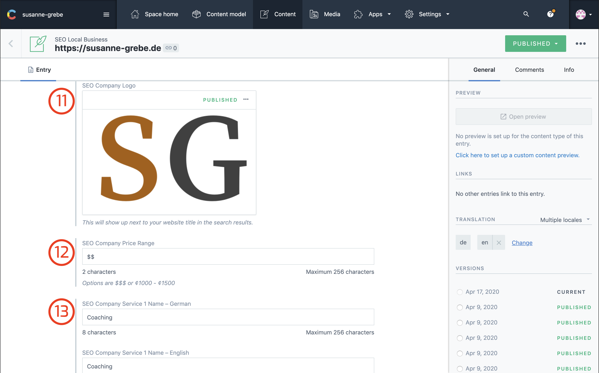
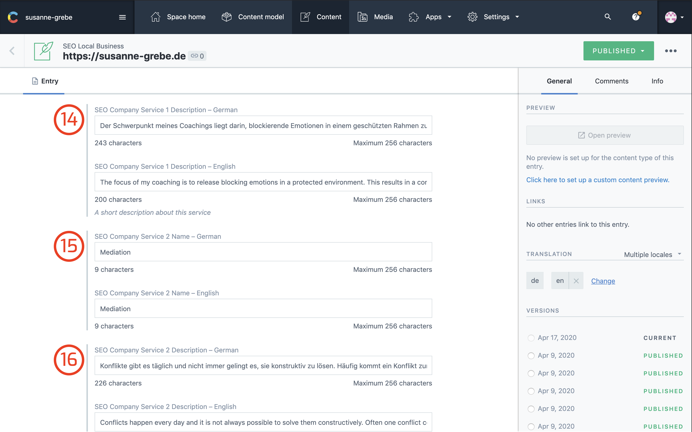
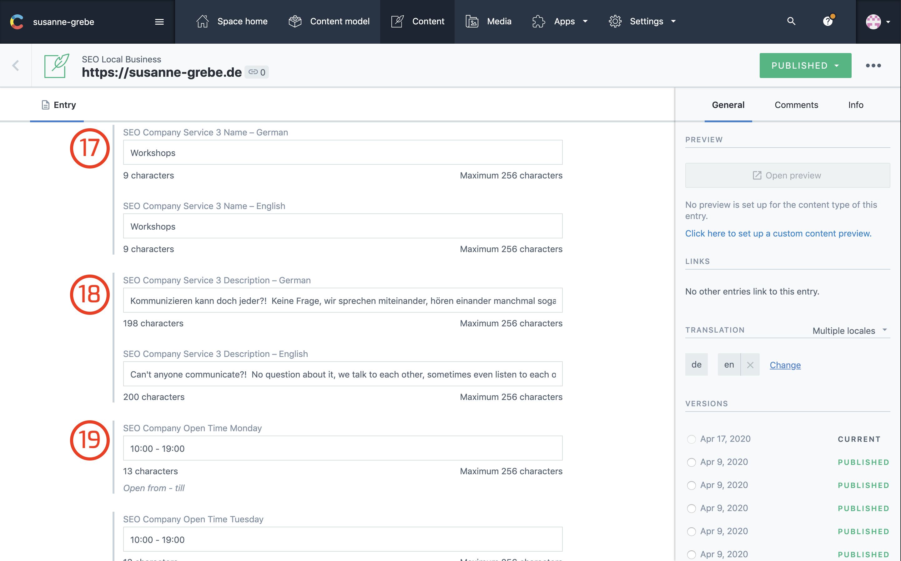
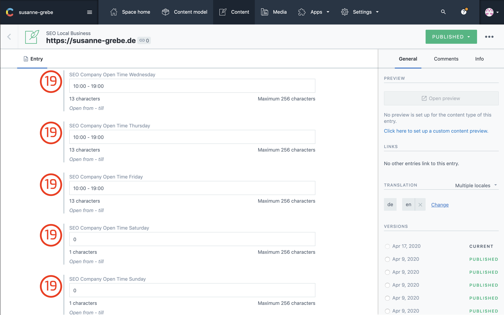
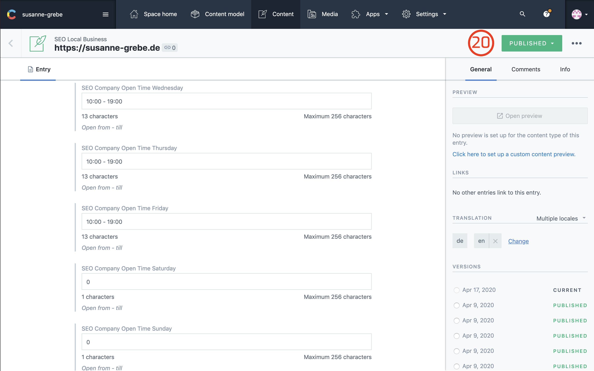

## Introduction

This is the part where you update your local seo content. 

Every section has a number in front of the section title that corresponds to the number in the image. 

After the title there is a little description for each field with suggestions, these don't have to be followed but are highly recommened.

## 1: SEO Url

This is the url to your website. The canonical URL is set to `https://www.susanne-grebe.de` this tells google that this is the original url.

As long as you don't change from domain this field should not be updated.

## 2: Company Name

The name of your business, it will show up as title in the google search results.

Therefore it's suggested to add your main keywords in the title.

## 3: Company Description

A short description of your business. 

This information will show up under the title in the search results, also here it is suggested you create content that contains your main keywords.

## 4: Company Telephone

Your business phone number. Sometimes google or other search engines will show a contact information field on the side of the search results.

Your phone number will be added under a button that says call now.

## 5: Company Email

This is your info@ email address.

All form submissions are forwarded to this email.
Same as with the phonenumber this will sometime show up in the contact information.

## 6: Company Street Address
## 7: Seo Company City
## 8: Seo Company State
## 9: Seo Company Postalcode

The street, city, state and postalcode of your business location.
Google preffers the following order of content

- Street Address `street housebumber` 
- City `Cityname`
- State `State Shorthand` example: NW
- Postalcode 

This information is used in the search results same as with the phonenumber and email, the address information can provide a google maps get direction link.

## 10: Seo Comapny Image

This is the image that shows up when someone searches for you business. On the right side of the search results there will be a information section.

The image at the top of that section will be this image.

## 11: Seo Company Logo

Google sometimes shows in the information section logo's 

## 12: Seo Company Price Range

This is the average price you ask for your services. With $ being cheap, $$ being average and $$$ being expensive.

You can also use a currency format if that's preffered.

## 13: Seo Service 1 Name
## 14: Seo Service 1 Description
## 15: Seo Service 2 Name
## 16: Seo Service 2 Description
## 17: Seo Service 3 name
## 18: Seo Service 3 Description

These fields are meant to display your services / products. Google might or might not show them under the description of your website in the results.

I added only 3 for now sinces the main services you offer are Coaching, Mediation & Workshops. If in the future you want to expand this feel free to ask me.

## 19: Seo company Open Time

Opening times also show up in the information window next to the search results.

Here you can edit your business hours from Monday till Sunday

## 20: Publish Changes

Whenever you made any changes you always need to publish these. The moment you publish the changes your site is rebuild by netlify and the cache updated.

If you don't see any changes you might want to hit `shift cmd r` on Mac and `shift alt r` on windows with the browser open.

It will trigger a hard reload of the page and clears your browser cache for that particular website.

