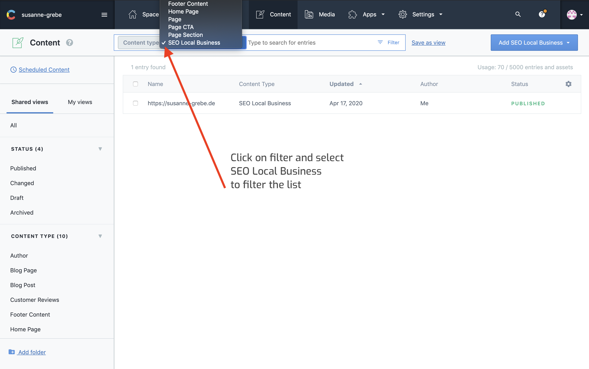
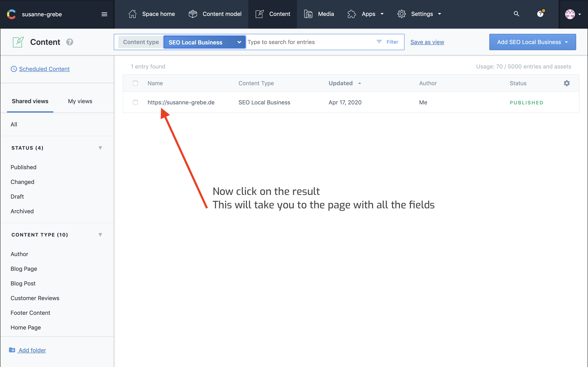

## Selecting Local SEO

To update any content in the local seo section you need to navigate to Content from here on your click on the filter button and select SEO local business.

Now the list with content results will be updated and show only one result.

Click on the result shown in the list, it will navigate to all the page to update the local seo.

## Select

on the search bar click on content type and select SEO Local Business

## Enter Fields Section

Click on the item in the list, this will take you to all the fields.

