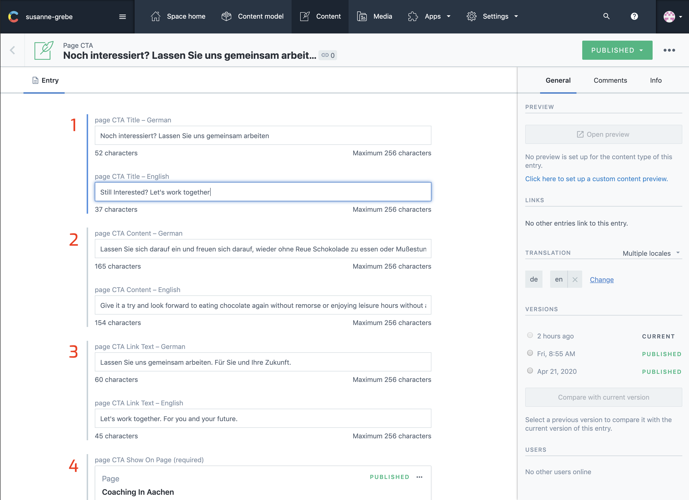

## Introduction

Page CTA `(call to action)` sections are designed to show on [Single Pages](/articles/Page/page/) at the very bottom of the page.

The CTA section is there to provide an easy way to contact you in case they visitor is interrested in working with you. All CTA section link to the contact page from where they can send a message or find you on social media.

---

## In Contentful

### Easy Filter Section

The most easy way to filter for page CTA sections is to select my views and than the page CTA section.
This will filter the list with only the section for that page.

1. Select my views.
2. Select page CTA section
3. Select section

---

### Page CTA Section Fields

1. CTA Title
2. CTA Content
3. CTA Link Text
4. CTA Show On Page

---

## On The Website

1. CTA Title
2. CTA Content
3. CTA Link Text

