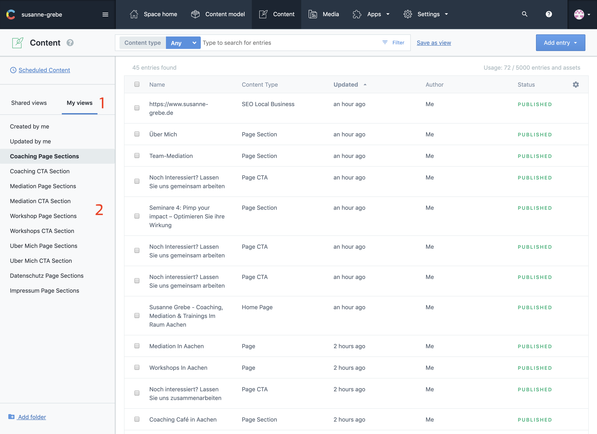
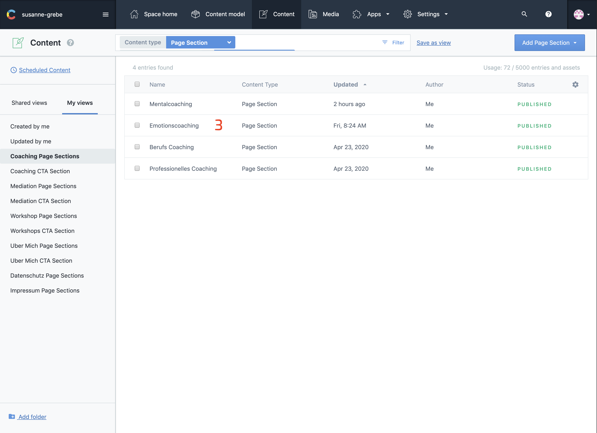
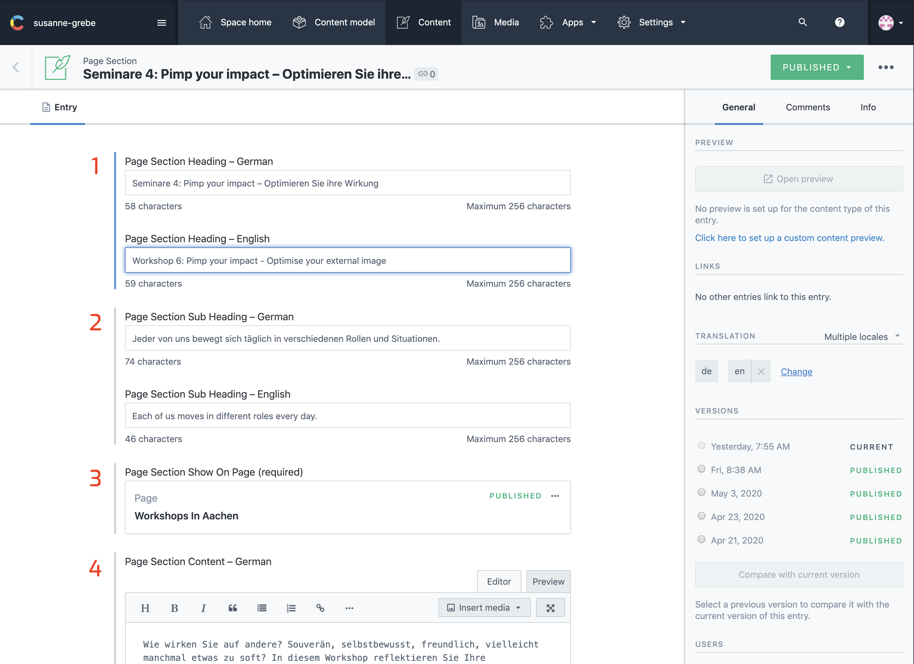
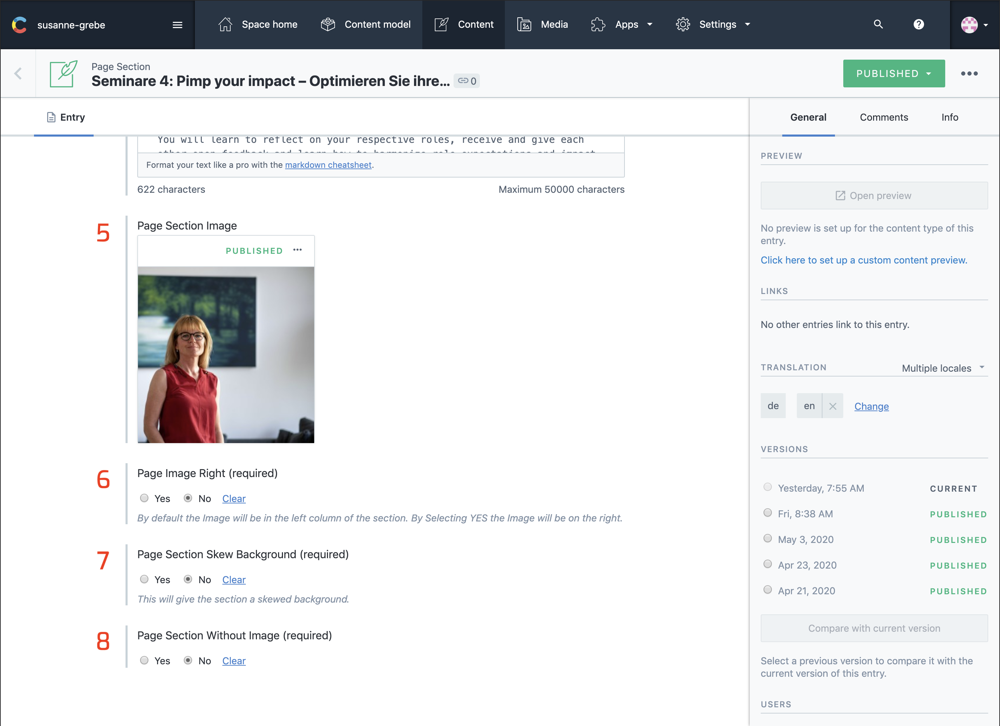
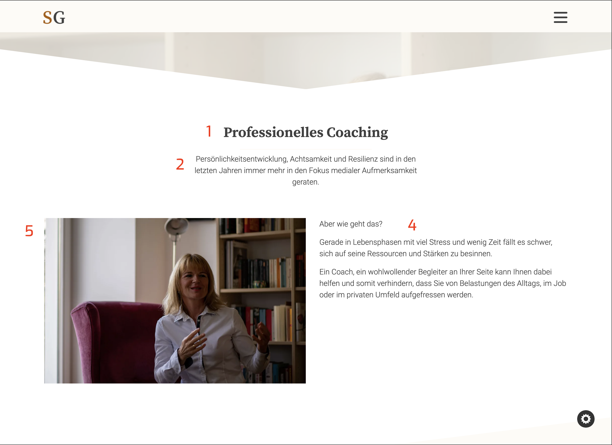
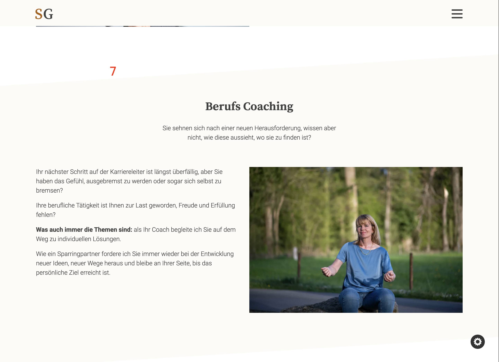
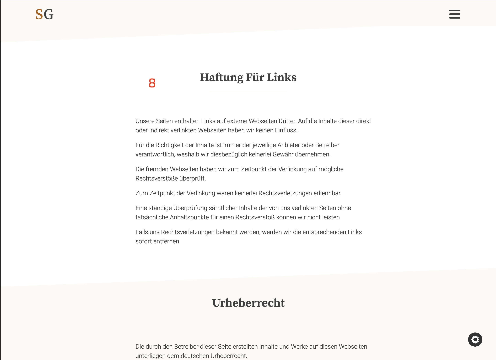

## Introduction

Page sections are designed to show on [Single Pages](/articles/Page/page/). Each page can have multiple page sections.

Each page section can have a different layout, you have the option to choose on which side you want to show the image, if the section has a background or if it's just a single column with only content.

---

## In Contentful

### Easy Filter Section

The most easy way to filter for page sections is to select my views and than the page section.
This will filter the list with only the sections for that page.

1. Select my views.
2. Select page section
3. Select section

---

### Page Section Fields

For __point 6, 7 & 8__ you need to have a look at the page you want to place the new section on. 

If the previous section has a skewed background and the Image on the Right the new section looks best without skewed background and and the Image on the left, __point 6 would be no__ and __7 would also be no__.

The section without Image __point 8__ would create a single column, even if you select an image for this section it won't show on the website.

This section was designed for information pages like the `datenschutz & impressum`, but can be used on a normal page too.

Each new section will be placed at the bottom of that page. Unfortunally at this time there is no way to choose a possition for the section, I keep watching this and if this becomes possible in the future I change this in the code.

1. Section Heading
2. Section Sub Heading
3. Show Section On page
4. Section Content

5. Section Image
6. Section Image Position left / right
7. Section Background yes / no
8. Section Without Image yes / no

---

## On The Website

1. Section Heading
2. Section Sub Heading
3. Show Section On page
4. Section Content
5. Section Image
6. Section Image Position left / right
7. Section Background yes / no
8. Section Without Image yes / no

