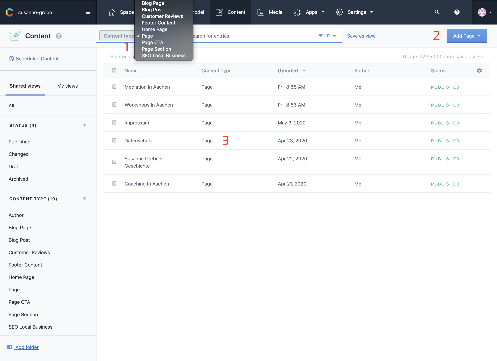
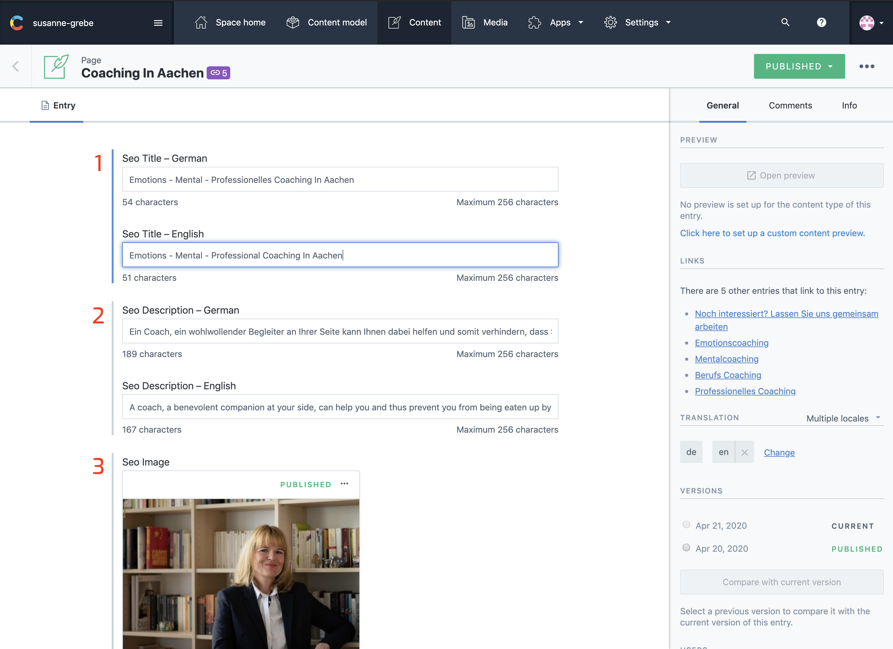
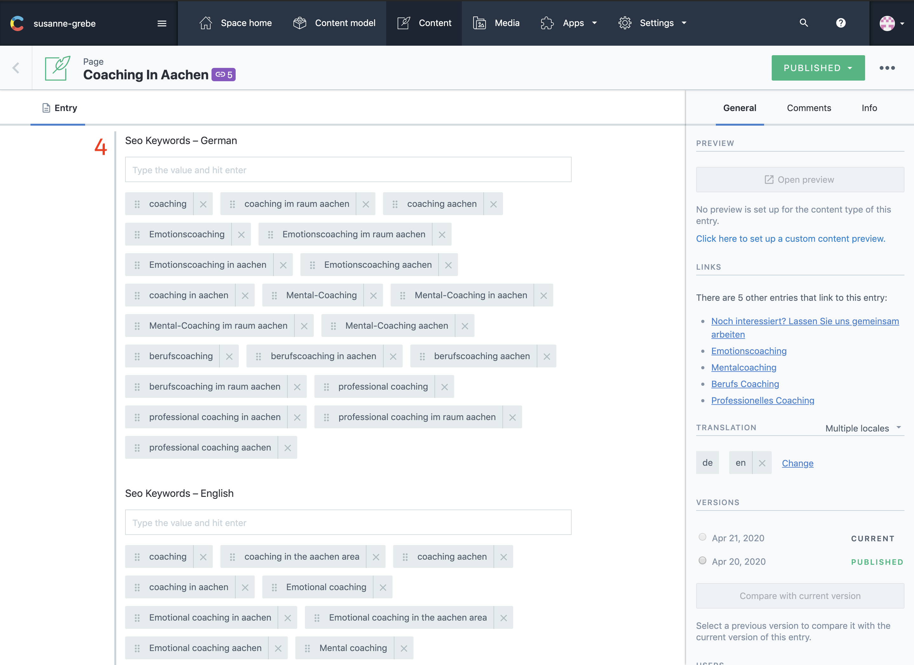
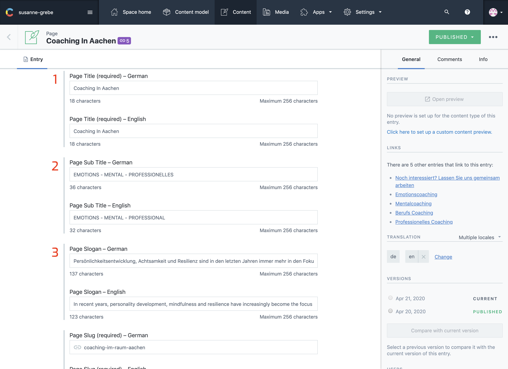
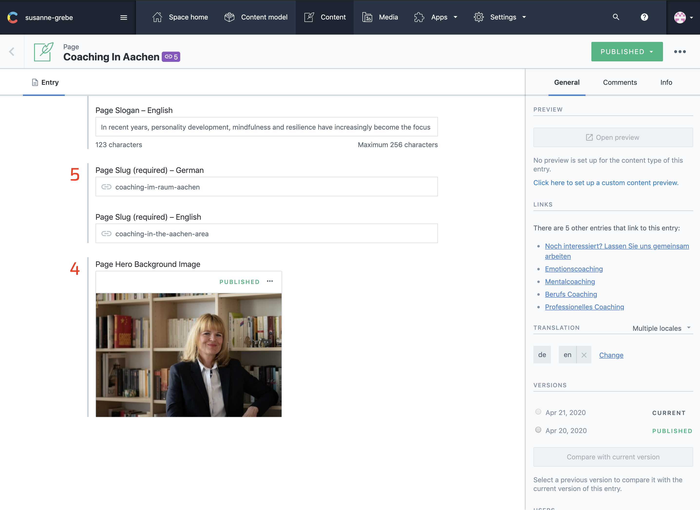

## Introduction

The pages you create are linked in a sitemap, they are not added to any menu. Only the existing pages are added to the menu's in the header or footer.

Pages can be used to display a single service or add important information. Each page is build up out of a few sections.

The page itself has 2 important sections, 1 is the seo part and 2 the hero part.
Then to each page you can add [page sections](/articles/Page/page-section/) `as many as you want` the options for this are explained in the page section documentation. 

At the end of each page you have the option to add a call to action, this call to action will link to your contact page.

---

## In Contentful

### Select 

On the content page click on the filter and select `Page`, this will filter all other pages.

Now you have the option to add or update pages.

1. Filter
2. Add New
3. Update Old

---

### Page SEO

Each page has it's own `seo` setup. The page `SEO Title, description and image` are also used when someone shares a link to that page on social-media or messenger apps.
The keywords are only there for the search engine bots to read what your page is about.

1. SEO Title
2. SEO Description
3. SEO Image
4. SEO Keywords

---

### Page Fields

This is the page's hero section. The first visable thing for humans when they visit the page.
Each hero has 4 fields.

__Note:__ The title and sub title can't be empty. The `Page Sulg` is created from these fields. For existing pages the page slug should not be changed. This will break the url to that page.

1. The Title
2. The Sub Title
3. The Slogan

4. The Background Image
5. The Page Slug

---

## On The Website

1. The Title
2. The Sub Title
3. The Slogan
4. The Background Image

